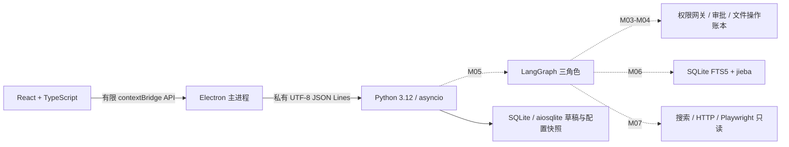

# 序航 Orvia 架构

## 设计依据与当前实现

依据本机技术设计 v0.7（2026-09-28），并以用户本轮要求更新模型映射。旧设计“同任务三个角色共用同一配置”已被下文各角色固定映射替代。
M01 实现桌面通信；M02 已实现 Pydantic/Zod 契约、SQLite 草稿、配置快照、主进程凭据加载与 safeStorage、固定模型适配；M03/M04 提供只读网关、审批动作和账本；M05 已接入 LangGraph 三角色合成闭环；M06 已接入任务范围上下文、偏好和 SQLite FTS5 检索；M07 已接入 Tavily 适配和受限 HTTP/Playwright 读取。其余组件为目标架构，是否完成必须查 DEVELOPMENT_PLAN 和 PROGRESS。

## 进程与协议（M01）

开发时主进程固定启动仓库 `backend/.venv/Scripts/python.exe`，`shell:false`、`windowsHide:true`；不查 PATH，不拼接 Shell，Python 不直接加载 `.env.local`。发布时由 M08 使用安装资源内固定 PyInstaller 后端；主进程从 `process.resourcesPath/backend/orvia-backend.exe` 启动，不查找系统 Python。
渲染进程启用 `contextIsolation`、`sandbox`，关闭 Node 集成和 webview；preload 暴露 health/settings/missions/createMission/saveCredential/removeCredential 六个固定能力。主进程检查调用者、主 frame、本地页面地址、参数个数及类型；拒绝新窗口、导航、权限请求及网络访问。
stdin/stdout 使用私有 UTF-8 JSON Lines，无监听端口。stdout 仅写协议，stderr 仅诊断。每行最大 64 KiB，包含 CR/LF；Python 超限时分块消费到下一换行并拒绝，避免内存无限增长和帧错位。

请求：`{"v":1,"id":"h1","method":"hello","params":{}}`。
成功：`{"v":1,"id":"h1","ok":true,"result":{"protocol":1,"service":"orvia-backend","python":"3.12.x"}}`。
握手后可调用 `health`，结果为 `{"status":"ok","service":"orvia-backend"}`。
失败信封含 `v`、`id`（无法识别则 null）、`ok:false`、`error.code/message`；固定错误码为 INVALID_REQUEST、UNSUPPORTED_VERSION、METHOD_NOT_FOUND、NOT_READY。
每次进程启动重置握手状态；hello 可重复，health 必须在握手后调用。Python 阻塞读取通过 `asyncio.to_thread` 与调度分离，EOF 干净退出。父进程负责超时及退出清理，不自动重放有副作用请求。

M02 在 hello 后增加主进程私有 initialize，参数为可信数据目录和内存凭据，不能从 renderer 调用；连接内不能替换数据目录。初始化失败终止后端，不自动新建备用数据库。credentials.replace 也仅主进程调用。
业务方法仅 configuration.status、missions.create/list/get，不提供任意后端方法透传。数据库返回经 Pydantic 校验、桌面再经 Zod 校验，生成 Schema 在 `contracts/`，Ajv2020 进行跨语言交叉测试。

## M02 存储与状态边界

`app.sqlite` schema v1 仅创建 missions 表和模型快照不可变触发器，使用外键、WAL、事务及连接内异步锁；未来版本拒绝打开，不覆盖。每个草稿固定三个角色 profile，只有 `draft` 状态。
客户端 client_request_id 为幂等键：相同标题返回原草稿，同标识不同内容报冲突。最新列表上限 20 条，按 ID 仍可读取旧项，暂不分页。SQLite 中没有 Key；UI 不接受自选模型或 SQL。
模型适配使用 httpx、固定 Base URL、无重定向/自动重试、20 秒超时、输出 token 上限与 64 KiB 响应上限。工具调用只作为待校验提议，不执行；模型输出无法变更授权。
M02 验证草稿持久化，不等于 M04/M05 的执行恢复。后续动作/审批/证据和 checkpoint 表按对应模块迁移加入，不提前创建空壳状态流程。

## 三角色与 Mission（M05）

| 角色 | 职责 | 固定模型 | Base URL | Key 变量 |
|---|---|---|---|---|
| Main | 规划、依赖、委派、重规划、证据与完成判断 | deepseek-flash | https://api.deepseek.com | DEEPSEEK_API_KEY |
| Computer | 文件、应用、进程、桌面任务；按需选原生工具或 PowerShell/Git Bash/WSL | glm-5.3-flashx | https://open.bigmodel.cn/api/paas/v4 | ZHIPU_API_KEY |
| Browser | 搜索与页面读取；静态优先 HTTP、动态使用 Playwright | mimo-v2.6-flash | https://api.xiaomimimo.com/v1 | MIMO_API_KEY |

三个角色是同一 Python 后端中的逻辑角色，不是三个服务，也不构成操作系统沙箱。每个 Mission 固化三个角色配置，禁止静默改模型、供应商或 Base URL。
LangGraph 实施经校验的计划与依赖，Main 不直接授予工具权限。程序负责事实核验，不能仅凭模型自述判定完成。MVP 同时仅一个执行子任务；审批、停止、恢复和撤销属于程序接口。M05 使用 SQLite checkpoint 保存图状态，真实模型规划未启用，Browser 服务已在 M07 独立提供但当前图不自动调用。

## 数据、凭据与上下文（M02/M06）

Python 管理 SQLite + aiosqlite 业务库，保存任务、依赖、动作、证据、偏好和审计；LangGraph SQLite checkpoint 保存编排恢复状态。Electron 不直接写业务库。
开发 Key 只放 Git 忽略的 `.env.local`，由 Electron 主进程只读；发布凭据通过 safeStorage 加密并原子保存至 userData/credentials.enc.json，只经私有通道交给后端内存，不进命令行、日志、checkpoint 或安装包。不可用/损坏时拒绝写入，不降级明文。发布 UI 提交后清空密码输入。
凭据落盘与后端同步不是一个事务：同步失败立即停止旧后端并要求重启，避免删除后继续使用旧 Key。桌面限制为单实例；本机 E2E 已验证实际 Windows 加密，完整安装包仍在 M08 验收。
上下文包含滚动摘要、显式偏好、任务内证据检索。轻量 RAG 使用 SQLite FTS5 + jieba 分词，不使用向量数据库，不全盘建索引；M06 只索引调用方明确提交的文本和来源。存聊天不等于完成 RAG。

## 文件安全与审批（M03/M04）

桌面整理限定用户授权的单一本地根目录和普通文件，不跨卷、不穿越符号链接/目录联接，不移动已有目录树，不执行仅大小写变化的重命名。
先只读扫描、文件名搜索、属性、空间分布、大文件和受限 UTF-8 文本；再生成创建目录、移动、重命名计划。用户批准具体版本后重新核对前置条件，执行后逐项核验并记账。
拒绝删除和覆盖。恢复必须区分已执行与未执行，不重放不确定写操作。撤销仅针对最近一次文件变更任务，并检查文件现状和冲突；不能承诺无限历史或无条件回滚。移动文件不算释放磁盘空间。

## Browser 与分发（M07/M08）

HTTP 读取用 httpx + trafilatura，动态页面用 Python Playwright + Chromium。Browser 只读，不复用用户 Cookie，不任意上传本地内容，不提供表单提交和其他浏览器写操作。
M07 私有 browser.read / browser.search 要求现有 Mission；显式 URL 仅允许同源重定向与单页资源，固定公开 IP 连接并保留 TLS 验证。Playwright 所有资源经相同网关 fulfill，CSP sandbox 与资源/时间/字节预算封闭写操作；不复用会话、不自动索引。具体边界和兼容限制见 Browser README。
搜索首个适配 Tavily；未提供 Key 时 `web_search` 明确不可用，不制造结果。已知公开 URL 的读取与搜索配置分别处理。
PyInstaller 已使用 onedir + console 保留 stdio，electron-builder 将后端和匹配 Chromium 放 ASAR 外；M08 已在本机完成资源、FTS5、动态依赖、浏览器版本、安装/卸载验收。无开发环境独立 Windows 机器和签名/发布渠道仍待补验。

## 后续能力边界

PDF/OCR、PPT、标书、完整行业调研、代码生成、原型、系统清理、任意脚本、桌面点击、浏览器写操作均不属于当前模块，也不是 MVP 骨架的已有能力。
