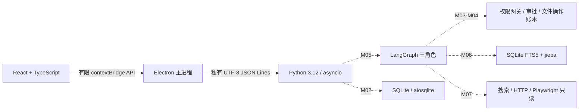

# 序航 Orvia 架构

## 设计依据与当前实现

依据本机技术设计 v0.7（2026-09-28），并以用户本轮要求更新模型映射。旧设计“同任务三个角色共用同一配置”已被下文各角色固定映射替代。
当前 M01 仅实现桌面容器、有限 IPC 和 Python stdio 握手/健康检查。本文其他组件是目标架构，是否完成必须查 DEVELOPMENT_PLAN 和 PROGRESS。

## 进程与协议（M01）

开发时主进程固定启动仓库 `backend/.venv/Scripts/python.exe`，`shell:false`、`windowsHide:true`；不查 PATH，不拼接 Shell，不加载 `.env.local`。发布时由 M08 改为安装资源内固定 PyInstaller 后端。
渲染进程启用 `contextIsolation`、`sandbox`，关闭 Node 集成和 webview；preload 仅暴露 `window.orvia.health()`。主进程检查调用者、主 frame、本地页面地址和零参数；拒绝新窗口、导航、权限请求及网络访问。
stdin/stdout 使用私有 UTF-8 JSON Lines，无监听端口。stdout 仅写协议，stderr 仅诊断。每行最大 64 KiB，包含 CR/LF；Python 超限时分块消费到下一换行并拒绝，避免内存无限增长和帧错位。

请求：`{"v":1,"id":"h1","method":"hello","params":{}}`。
成功：`{"v":1,"id":"h1","ok":true,"result":{"protocol":1,"service":"orvia-backend","python":"3.12.x"}}`。
握手后可调用 `health`，结果为 `{"status":"ok","service":"orvia-backend"}`。
失败信封含 `v`、`id`（无法识别则 null）、`ok:false`、`error.code/message`；固定错误码为 INVALID_REQUEST、UNSUPPORTED_VERSION、METHOD_NOT_FOUND、NOT_READY。
每次进程启动重置握手状态；hello 可重复，health 必须在握手后调用。Python 阻塞读取通过 `asyncio.to_thread` 与调度分离，EOF 干净退出。父进程负责超时及退出清理，不自动重放有副作用请求。

## 三角色与 Mission（M05）

| 角色 | 职责 | 固定模型 | Base URL | Key 变量 |
|---|---|---|---|---|
| Main | 规划、依赖、委派、重规划、证据与完成判断 | deepseek-flash | https://api.deepseek.com | DEEPSEEK_API_KEY |
| Computer | 文件、应用、进程、桌面任务；按需选原生工具或 PowerShell/Git Bash/WSL | glm-5.3-flashx | https://open.bigmodel.cn/api/paas/v4 | ZHIPU_API_KEY |
| Browser | 搜索与页面读取；静态优先 HTTP、动态使用 Playwright | mimo-v2.6-flash | https://api.xiaomimimo.com/v1 | MIMO_API_KEY |

三个角色是同一 Python 后端中的逻辑角色，不是三个服务，也不构成操作系统沙箱。每个 Mission 固化三个角色配置，禁止静默改模型、供应商或 Base URL。
LangGraph 实施经校验的计划与依赖，Main 不直接授予工具权限。程序负责事实核验，不能仅凭模型自述判定完成。MVP 同时仅一个执行子任务；审批、停止、恢复和撤销属于程序接口。

## 数据、凭据与上下文（M02/M06）

Python 管理 SQLite + aiosqlite 业务库，保存任务、依赖、动作、证据、偏好和审计；LangGraph SQLite checkpoint 保存编排恢复状态。Electron 不直接写业务库。
开发 Key 只放 Git 忽略的 `.env.local`；发布凭据拟由 Electron safeStorage 保护，只经私有通道交给后端内存，不进命令行、日志、checkpoint、安装包或测试数据。
上下文包含滚动摘要、显式偏好、任务内证据检索。轻量 RAG 使用 SQLite FTS5 + jieba 分词，不使用向量数据库，不全盘建索引。存聊天不等于完成 RAG。

## 文件安全与审批（M03/M04）

桌面整理限定用户授权的单一本地根目录和普通文件，不跨卷、不穿越符号链接/目录联接，不移动已有目录树，不执行仅大小写变化的重命名。
先只读扫描、文件名搜索、属性、空间分布、大文件和受限 UTF-8 文本；再生成创建目录、移动、重命名计划。用户批准具体版本后重新核对前置条件，执行后逐项核验并记账。
拒绝删除和覆盖。恢复必须区分已执行与未执行，不重放不确定写操作。撤销仅针对最近一次文件变更任务，并检查文件现状和冲突；不能承诺无限历史或无条件回滚。移动文件不算释放磁盘空间。

## Browser 与分发（M07/M08）

HTTP 读取用 httpx + trafilatura，动态页面用 Python Playwright + Chromium。Browser 只读，不复用用户 Cookie，不任意上传本地内容，不提供表单提交和其他浏览器写操作。
搜索首个适配 Tavily；未提供 Key 时 `web_search` 明确不可用，不制造结果。已知公开 URL 的读取与搜索配置分别处理。
PyInstaller 使用 onedir + console 保留 stdio，electron-builder 将后端和匹配 Chromium 放 ASAR 外。FTS5、动态依赖、浏览器版本、安装卸载与无开发环境机器运行属于 M08 实际验收。

## 后续能力边界

PDF/OCR、PPT、标书、完整行业调研、代码生成、原型、系统清理、任意脚本、桌面点击、浏览器写操作均不属于当前模块，也不是 MVP 骨架的已有能力。
