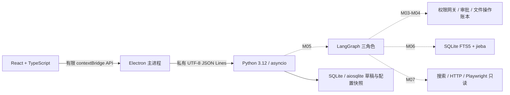

# 序航 Orvia 架构

### V4-010 有界调研与成品组合（2026-10-08）

ResearchService在SQLite保存任务、单消费阶段尝试与准确不可变来源关联，调研采集不挤入或扩M20三附件。现Browser安全读取→原文/Evidence身份→研究精确来源检索（前后版本/撤回核验）→准确system/input原生批准→固定Main→引用结构校验→保存synthesis→现Publication独占新文件及准确保存事件回执。摘要不替代原文、ready只表明回答已保存；Skill进一步核对实际采集范围/限制，pending或limited停止组合。

控制旁路仅status/history/cancel；独立采集120秒、每批30秒、无自动重试。启动标中断而不恢复许可，删除journal同事务清研究三表；FTS最终事务墓碑阻迟到正文。Renderer固定八入口不接受自由方法/URL网络写操作、SQL、路径或模型配置；原生重核planned只准备新审批，不恢复旧许可。预算与真实/mock证据见模块README/PROGRESS，011尚未实施。

### V4-009 普通用户进程架构（2026-10-08）

ProcessPanel→六个固定IPC→process-ipc原生exe/cwd选择/完整风险确认→七个私有stdio方法→ProcessService→native ctypes/psutil。精确身份包含PID/名称/路径/create_time/creation_ticks字符串/全文SHA256，不读取真实cmdline/env/window正文或返回SID；完整preview同时绑定action/argv/cwd/wait_seconds/revision，不能用renderer approved或程序自述授权。Windows同用户普通Token、低于High完整性、非AppContainer/UIAccess、critical/protection可读、关键PID/祖先/Orvia程序拒绝；核验与动作沿用同一个HANDLE防复用。

启动CreateProcess挂起、cleanenv无Key/proxy、实际handle复核后resume，未释放失败只收回该自有新进程；释放后wait1～15秒只观察，不因超时/关闭服务自动kill。close仅该PID顶层窗口WM_CLOSE，close_sent实际投递且未退可still_running；TerminateProcess只能另批单目标，不递归/广播/自动升级。exe64MiB身份预算，list扫描2000/2秒、50/48KiB，args16/每1000字合8KiB，完整包48KiB/内存20。

SQLite process_attempts128不淘汰、process_executions32/历史10；先记running，终态只有实际退出/仍活/未知，业务不由exit判断。restart running→unknown无重放，运行/未知阻止会话删除，已知still_running不阻止删除事实也不kill程序。失效Job来源只由用户准备准确目标时从当前cid已保留launch/verified/still_running记录fresh同handle恢复登记，unknown/跨cid/淘汰/目标变化不恢复；一般外部Job保守拒，登记不是动作许可。最终alive与墓碑检查、purge两表同事务，先于chat删除journal初始化，不保留正文缓存。真实合成Windows程序/窗体、实际Electron关闭目标存活与重启新批准验证；普通权限有系统副作用且无法撤销，具体边界见README/PROGRESS，无提权/系统配置/模型调用。

### V4-008 Shell执行架构（2026-10-08）

Electron ShellPanel→七个固定IPC→shell-ipc原生选择/完整审批→九个私有stdio方法→ShellService→runtime。预览绑定exe SHA/version、完整脚本、cwd/输入/核验和预算，review复核后才原生一次批准；真正启动前再次检查令牌/exe及输入。脚本16KiB、每输出流16KiB、运行1～60秒、审批/完整结果48KiB；输入3/30MiB，指定产物10/2MiB只是回查预算，不能保证任意磁盘写入配额。

SQLite独立shell_attempts128次不可淘汰，启动前running；shell_executions32份/展示10，取消/超时/退出/未知与verification分开，exit0不证明业务完成。重启不执行，运行→unknown；状态/取消/历史stdio旁路仍严格校验。会话删除检查所有尝试，未知阻止删除，私有任务正文在删除journal恢复前可用并安全清理，最终同事务purge两表，迟到不能重建。用户输入原件/cwd/新导出保持，回传独立准确SHA/新位置原生批准、独占创建fsync读回。

Windows挂起进程先入既有kill-on-close Job再resume，干净env无角色密钥；原生创建不可取消时保留后到Job直至清理，极端阻塞可能超过预算。WSL普通非root用户/准确distro/bash工具身份、setsid PGID/SID/starttime/nonce/gate与Linux组回查；未独立回查不能称回收。普通Shell并非LPAC/网络路径隔离，Job只覆盖成员、Linux组只覆盖自有组，外部broker/新session逃离不保证回收。真实Windows三解释器及Electron已验，本机只有Docker管理发行版，WSL不可用及未真实验收明确显示。不自动安装/切换/提权/重试，模型配置不变。

### V4-007 MCP客户端架构（2026-10-08）

McpService将配置、连接、发现工具审查与逐次调用分开；SQLite全局mcp_servers/mcp_tool_reviews不恢复权限，会话mcp_attempts/mcp_executions保存实际尝试/校验响应并纳入同事务purge和最终alive核验。每次工具清单分页重核，metadata/schema或session变化即失效。后端只暴露固定方法，renderer不能直接提供程序、URL、凭据、SQL或批准标志。独立MCP令牌只Electron safeStorage与后端内存，角色模型配置不变；不调用模型。

冻结MCP2025-06-18有限JSON/schema子集，stdio由挂起进程先入kill-on-close Windows Job再恢复，干净env及继承handle白名单；HTTPS准确canonical endpoint、TLS校验、无env代理/redirect，POST JSON/SSE绑定版本/session，有限DELETE关闭。协议请求20秒、连接30秒、完整调用60秒含前后发现，不重试。无法取消的原生CreateProcess清理须等待同步调用返回，极端迟滞可超过协议预算；不提前报告回收。children_reaped只证明ownedJob成员，不保证普通权限服务经WMI/外部broker的进程也入Job；服务并非LPAC沙箱。输出和服务器声明不能授予权限或证明业务完成。预算/实际验证见mcp README/PROGRESS，无SDK或第三方服务安装。

## 设计依据与当前实现

2026-10-03状态校正：M15–M19已实现、验证并提交，M19 `6f87fe0`已由用户手动push且本轮10月2日实时确认main同步。M20统一自然语言／真实事件及完整安装包对照已授权；四项产品方案A均已确认，当前实现及接口见下节，实际验收状态见PROGRESS。下文各模块旧状态保留为历史基线，不替代当前记录。固定三角色、原生授权、审批、后端复核和M18隔离不变。

## M20 统一请求、资料与真实结果流

renderer将等待资料的paused与不可复活的完成/失败/取消终态分开；同一请求接续可以直接发工具状态、增量或完成，无需虚构started。pull/ACK异步回包只回收原目标对象，重新读取最新缓存，最多20条流轮询本地主进程缓存，不自动执行业务。新建/切换/重连增加视图epoch，创建会话的过时回包仅刷新侧栏，不覆盖当前草稿、阅读位置或焦点。

默认输入“你想做些什么”，统一“＋”菜单分别调用主进程原生文件／文件夹选择器。`chat.natural`绑定会话与请求UUID；有界意图识别只规划既有能力。明确只读列表无需模型，唯一有效对象直接处理；多候选或缺必要参数保存问题和一次性`continuation_id`，`chat.continue`接续同一原请求。复合步骤最多4个，更多步骤需澄清，不能静默丢弃。正文中的网址和命令不成为新指令。写入／执行／外发保持对应原生批准及后端事实复核；浏览器填写仅能满足填写步骤，发送步骤必须核对同站点／类别的新操作和实际外发账本及回执。

`m20_materials`注册最多3个当前有效来源；本地附件每个10MiB、合计30MiB，逐个解析并显示失败。移除只改变有效关联，不删除原文件、不可变证据或历史引用；资料修改使发送预览及旧接续失效。重启仅保留资料事实，不恢复目录token或未完任务；切会话、取消选择、重连不会自动重放。M15确切片段预览及原生上云确认继续独立执行。

目录默认一级；明确递归默认3层、最高8层，访问最多5000项／扫描总时间10秒（含结果发送等待）／4MiB元数据。每批最多40项并留出完整12KiB事件信封；先将实际条目事务落盘，再单独持久化事件序号，发送失败仍保留已发现事实。`chat.scan.page`按不可变扫描ID读取最多100项／48KiB，使用实际游标，不能跳过长路径条目或重新扫描冒充历史。直接回答明确已访问／发现／展示、范围、深度、拒绝和截断，扩展名分类不证明正文理解。

事件`started/tool_status/scan_batch/model_delta/paused/completed/failed/cancelled`带运输请求ID、会话ID、业务请求ID、流ID和持久递增序号。M15生成子请求使用独立运输／业务身份；父请求只在核验成功后接续，失败不能把父事件发送在子运输帧中。后端单一写入队列32帧，10秒背压限；主进程全局80事件／128KiB、每次pull最多40事件／48KiB，最多16个流身份、16项乱序和2秒缺口限。ACK只释放本地缓冲；重复内容核对、变造／身份不符／慢消费关闭连接，不重启或重放任务。

模型使用固定供应商真实SSE，网络20秒、模型等待30秒、自然阶段合计50秒；意图理解/普通回答每请求最多1024输出token，M15综合保留原4096上限，明确同模型非流式新请求亦相同（适配器默认256不是业务上限）。增量JSON解码仅展示实际收到的顶层answer新增文字，标为待终态及引用校验；claims和引用完整核验前不能保存成功成品。真实结束原因length先明确预算截断，stop后JSON不完整明确结构失败，不能都说供应商不可用。缺凭据／不支持流式明确失败；只有一次原生明确批准后才用同模型发新的非流式请求，提示可能重复费用。M15降级仍要求原确切片段预览。未知副作用、取消和断线不自动重试。

`m20_streams.model_text`将实际模型正文前缀与递增序号在同一次UPDATE持久保存，再输出事件；前缀最多16000字且JSON编码24KiB，超限前拒绝追加和呈现。失败／取消／暂停／重启中断后，快照从SQLite幂等恢复同一流的一条`model_partial`历史，明确未核验、不可成品；后续状态更新保持消息ID不变。公开stream只返回身份／序号／状态，不重复携带正文。历史恢复不重发事件、模型或权限；成功回答仍须独立完整结构／引用校验。真实stdio终止与两次重启已验证已显示前缀保留，具体证据见PROGRESS。

renderer按会话保存草稿与阅读位置；首次读历史从顶部开始，增量不抢焦点、覆盖草稿或强制滚底。固定帧循环批量拉取／ACK，暂停阶段可接续同序号，终态清理有界流缓存；保持IME组合状态和Shift+Enter。握手与初始化分别20秒，连接后健康保留短期限；会话协议65秒仅留出持久化和返回时间，不延长模型或扫描预算。

依据本机技术设计 v0.7（2026-09-28），并以用户本轮要求更新模型映射。旧设计“同任务三个角色共用同一配置”已被下文各角色固定映射替代。
M01 实现桌面通信；M02 已实现 Pydantic/Zod 契约、SQLite 草稿、配置快照、主进程凭据加载与 safeStorage、固定模型适配；M03/M04 提供只读网关、审批动作和账本；M05 已接入 LangGraph 三角色合成闭环；M06 已接入任务范围上下文、偏好和 SQLite FTS5 检索；M07 已接入 Tavily 适配和受限 HTTP/Playwright 读取。其余组件为目标架构，是否完成必须查 DEVELOPMENT_PLAN 和 PROGRESS。

M10 在上述能力上接入对话式桌面界面与 `ChatService`。下文 M01–M08 标记描述历史层次；当前前端入口、持久化与审批行为以本节和模块 README 为准。

## M15 有界模型理解与正文发送

M15 在现有会话增加固定 `chat.synthesis.preview/generate`，不改变文件规划入口。用户选择当前会话 1–3 个 M12 网页或 M13 文档不可变证据版本；后端再次按会话归属读取版本，文档按原页/段/幻灯片单元、网页按正文分块，每源最多选 3 个 600 字片段。摘要采样前/中/后，问答优先 M06 命中并补头部；覆盖率、原提取截断、缺失单元和 OCR 来源明确显示，未选片段不送云端。

renderer 只持证据 ID、模式和问题，不能传正文、路径、模型或供应商。主进程记录实际返回的预览身份，生成前复取并核对 revision，弹原生确认框后才允许一次性发送；取消不调用模型。后端仅使用 Mission 固定 Main `deepseek-flash`/`https://api.deepseek.com`，一次请求、20 秒适配器超时、30 秒等待预算、4096 输出 token、零自动重试；没有工具调用。确认的片段、定位、问题与系统规则进入 Main 云服务，附件选择、网页读取和关键词检索本身均不授予上传权限。Computer/Browser 固定配置不变。

模型结果为 JSON 结论和 `fact/inference/conflict/unknown` 分项。程序只接受本轮片段 ID，复核证据版本、会话和文档单元/网页块定位；冲突至少两个引用，未知项无引用。结构校验不证明语义支持，界面提示回查原文。结果及覆盖、模型名、用量入本地会话消息，原正文仍在证据库；生成请求复用 pending/幂等/中断/取消，不自动重发或触发文件动作、审批与写入。外部资料和模型输出均为纯文本不可信数据，不能改变主进程授权。M19视觉已接入且本机验收通过；M20自然请求与真实文本增量当前已接入，失败/partial不提升为成功，见本文件M20节及PROGRESS。

## M16 已保存回答到本地简报成品

M16 增加固定 `chat.publication.preview/save`，以当前会话一条已保存的 M15 结果为唯一内容源。用户可编辑标题、摘要和结论文字；结论类别、引用编号、证据版本与定位只从原消息映射。后端页面计划包含正文与来源附录、原消息数据摘要和 SHA256 revision。主进程只保留最近一次预览的输入与 revision，保存前重新取预览，原生保存框给出一次性新文件路径。renderer 不持路径、模板、写入字节或自由方法名。后端再次检查消息归属/版本，通过 Computer gateway 的 PathPolicy 与 `x+b` 独占新建，fsync、句柄身份及读回字节核验；重试和中断遵循会话账本，不自动重放或覆盖。

生成器在本机使用 python-docx、python-pptx、ReportLab 和随包字体，不依赖本机 Office 或云转换。DOCX/PPTX 再用对应解析库重开；PDF 用 pypdfium2 验证页数。图片、外部模板、宏、图表和公式不输入此流程，引用仅校验映射，用户改写文字后需自行核对语义。Word 的最终分页由打开软件决定；PDF 和 PPT 采用固定页面安排与溢出预算。成品写入独立于 M04 整理审批/撤销；M13 附件路径权限和 M15 上云确认均不因此扩大。固定三角色模型不变，M16 本身零模型调用。

## M17 代码提案、原型与旧临时文件隔离

`chat.development.context/generate/draft/apply` 共用当前会话及 Computer 已授权目录。renderer 只提交需求、显式相对文件路径、证据 ID 或已保存回答 ID；后端以既有 PathPolicy 和 M06/M12/M13/M15/M16 归属校验取得有界实际正文。需求、选择和正文绑定 SHA256 预览版本；main 复取并经原生框确认后，固定 Computer `glm-5.3-flashx` 才收到这些内容，20 秒 HTTP/30 秒总等待、最多 4096 输出 token、无自动重试。模型返回的 JSON 只能形成 SQLite 草稿，程序拒绝越界路径/类型/规模，展示逐文件完整源码和差异。main 每文件独立原生确认；后端再次检查授权根、目标身份/哈希和版本，同目录暂存、替换或独占新建、读回核验。代码不能给自己执行、联网、安装或部署权限。外部资料和模型输出始终是不可信数据。

原型让模型只提出 1–4 页结构化纯文案，后端固定生成 HTML/CSS/JS 可编辑源码。应用中的交互预览由 React 固定组件转义渲染，不执行源码，页面导航和表单反馈明确为 mock；真实业务接口、部署或运行环境未接入。`chat.cleanup.scan/plan/execute/restore` 与生成草稿分账本：清理根只能是 Windows 当前账户已知 `%LOCALAPPDATA%\Temp` 顶层，候选限旧 `.tmp/.log` 独立普通文件。SQLite 计划记录身份、大小、风险和 revision；main 原生框按选中项和版本批准，后端执行前再校验，逐项先记状态，再同卷隔离并核验；中断不重放。30 天内按账本恢复，冲突拒绝覆盖；到期不自动删除。隔离移动量单独报告，实际释放空间为 0。系统目录、注册表、永久删除和通用任意脚本没有 M17 接口。

## M18 脚本、桌面与浏览器写操作

`automation/` 经 Application 固定 `chat.automation.*` 装配，与 M17 草稿/清理和 M07/M12 只读网关分开授权。main 的 `m18-ipc.ts` 保存后端实际预览身份，原生选脚本/应用/站点和逐步确认；renderer 只有固定业务方法，不能传执行器、绝对路径或 `approved`。后端固化会话、目标、源码/参数、输入哈希和300秒 revision，SQLite `m18_operations` 在派发前条件更新为 running。相同步骤不可重放，重启把未收尾步骤记 interrupted 且不恢复内存权限。状态/取消/待请求旁路长任务；桌面动作全局串行，避免争夺整机焦点。

Python 仅从固定3.12解释器复制私有标准库运行时，不自动安装。私有 exe/DLL/pyd 的固定 RT_MANIFEST 变换避免 LPAC 下 SxS 初始化失败；原安装未改，私有副本原签名失效，以完整哈希清单核验。每任务独立 LPAC SID，零capability、Low integrity、UIAccess=0，挂起后核验令牌/Win32k禁止/Job再恢复。显式输入复制只读、源码和runtime只读、output可写；Job控制30秒/512MiB/4进程、KillOnClose、全部UI限制，输出16KiB、产物最多12项/单项2MiB/总16MiB采样监测。标准库涉及GUI/网络/进程调用可能被OS拒绝；Job不是磁盘配额，LPAC还可读Windows授予低权限应用的基础资源。产物复用Computer gateway/PathPolicy，独占新建、fsync、读回，不直接改原输入。不验证隔离就不执行。

桌面固定Windows PowerShell5.1 MTA工作器只接程序JSON，不执行用户PowerShell；PID/创建时间/会话/HWND/exe身份绑定，限制被选窗口树和唯一UIA控件，密码原生样式及子树屏蔽。原生审批后重新核对树/焦点，支持Value/Invoke/Selection/Toggle/Focus；无盲坐标。原生新文件保存经私有staging再独占复制，应用当前文件仍指向staging；普通保存框动作不可绕过路径批准。UIA核验的是控件状态，不证明交易等业务真值。普通目标应用并非OS沙箱，外发类别另行确认点击业务动作，HTTP层不能由桌面网关拦截。已知个人浏览器通过专用Browser入口，终端/IDE/提权/安全界面拒绝，任意自绘应用兼容性不承诺。

BrowserAdapter 启动独立可见Chromium非持久context，手工登录，只保留本次内存Cookie；WriteNetwork复用公开地址/DNS固定IP/TLS策略。所有网络由route拦截再经固定出口，不continue直连；准确origin逐个原生授予，Worker/子框架/WebSocket/下载不开放。后续导航、动态GET、非GET/自动保存逐请求暂停，当前URL/method/字段/文件/hash/截断与脱敏元数据形成新的180秒审批版本；无授权零外发。2xx仅response_received，必须有本步回执且审批前指定的新文字出现于真实DOM才verified；这仍不证明服务器结算等业务语义。发送阶段取消/断线为uncertain，绝不自动重试，关闭回收专用会话。账本只存元数据/摘要，不持久化原始网页、网络正文、密码、Cookie或默认截图。

Windows可见Chromium由SDK固定来源原样复制到私有版本目录，根chrome.exe与版本内DLL/资源采用一致布局，不混用两份ELF。源/副本完整hash及目录预算、独立文件/manifest复核；只有公开程序副本给AppContainer/LPAC组只读执行，不授权profile或任务数据。明确启用Chromium sandbox，不拓宽私有管道环境，不改原SDK或系统SxS。真实合成窗读回renderer非提升/Untrusted令牌、审批前0写/批准后1写和正常关闭后的进程回收。页面初始化有界，失败关闭自有浏览器，不以headless或个人浏览器回退。

固定三角色模型保持不变；可选Python模型草稿只向固定Computer发送用户需求，一次/4096输出token/30秒/零重试。M18开发验证只用合成数据，不把模型/HTTP替身当真实供应商或网站验证。完整接口、试用和限制见 [automation README](../backend/src/orvia_backend/automation/README.md)。M14旧包不含M15–M18；M20本轮已完成完整包重建、实际安装运行时与开发版对照，证据见PROGRESS；签名及独立Windows仍暂缓。

## M13 本地文档与导出边界

输入框显式附件选择经 main 原生单文件选择器传入 `chat.document.attach`，renderer没有路径字段。Computer gateway复用PathPolicy拒绝UNC/链接/重解析/ADS/敏感目录并核对读取句柄，不建立父目录权限。10 MiB字节送固定解析子进程，45秒硬预算、独立环境、无云端请求；解析器支持PDF文本、无文本层PDF/图片本地OCR、DOCX段落、PPTX幻灯片，最多50单元/8000码点，44 KiB解析结果。worker不持有用户路径、凭据、网络客户端或授权；无原始附件临时副本。

`document_evidence`复用M12不可变版本存储和归属检查，保留原文件/内容SHA256、时间、提取方式、OCR分数、页/段定位、缺失与截断。M06以`document:<version>:<unit>`索引，询问文档返回最多5个原文引用，不调用生成式模型。文档与网页消息均排除在Main文件规划指令历史之外。历史证据可读不等于原文件权限恢复。

导出预览只生成该版本的Markdown/JSON原文摘录，显示引用覆盖、缺失和截断；main记录预览身份并要求独立保存框确认，消耗一次性预览授权。后端核对revision、PathPolicy校验父路径，`x+b`独占创建、fsync与读回核验；不覆盖、不执行文档指令、不沿用目录审批、不提供任意写内容接口。导出事实回到同会话卡片，失败中断不重放，可能留下需人工核对的部分新文件。此导出不是M04可撤销整理动作。

目录最近20版本/8 KiB、总快照46 KiB；所有请求复用100次会话预算。Office外部关系、宏和加密拒绝；文档中的HTML/URL均纯文本，Markdown原文代码围栏避免活动内容。OCR不等于事实核验，Word段落不是真实页码，不识别复杂布局与公式语义。M13不生成Office/PDF。M14已将这些依赖冻结进未签名测试候选包，独立机器和生产签名由用户暂缓。

## M12 会话来源与证据边界

对话输入框选择文件任务/搜索网页/读取网页/询问已有来源。新增固定 chatBrowserSearch/Read/Ask/Source；main 校验调用来源、严格参数和串行忙碌状态，preload 没有通用 IPC，renderer 仍禁止网络与导航。Browser 请求直接复用 M07 BrowserService，不需目录授权，不产生文件计划。搜索只有 Tavily 专用 POST；正文是 HTTP 优先、受限动态 Playwright，原 URL/DNS/重定向/预算策略不变。

EvidenceStore 在现有 app.sqlite 创建 browser_evidence，按 Mission 隔离，以 URL/模式/正文哈希等确定不可变版本。重复来源去重并保留首次访问时间，新的对话事件记录本次请求时间；搜索摘要与正文独立。M06 索引 source 为 browser:<evidence_id>，引用回查必须同时匹配会话。来源目录最多20项/12 KiB，单独详情最多8000个 Unicode 码点，整体快照46 KiB。TS 使用码点计数，与 Python 一致。网页 HTML、URL、标题都只作为文本，不能驱动权限或工具。

search/read/ask 共享会话请求100次预算和 pending/completed/failed/interrupted 去重；中断不自动重发。来源保存和 FTS 写入不是一个跨模块事务，存储中断保留已落盘来源，显式重复读取可以修复对应索引。source/source_request 消息不进入 Main 文件规划历史。询问来源当前为本地关键词检索，返回最多5个原文片段及引用，不做模型总结/语义问答，不联网；无证据明确说明。固定 Main 仍只处理文件任务，本模块不调用 Browser 模型或更换任何角色配置。

M12 无附件、导出、自动任务、技能市场或浏览器写操作。测试使用真实 Electron/Python/SQLite/Chromium 与合成 DNS/HTTP，不代表真实互联网兼容性或安装包已验收。

## M11 稳定性与进程生命周期

在 M10 受限接口上增加 `chatCancel/connectionStatus/reconnect`。取消仅绑定当前会话和请求，后端只中断模型等待；不取消计划事务、审批或文件动作。stdio 普通请求仍串行且积压上限32，只有 health/chat.cancel 旁路，响应按 ID 配对。错误边界返回固定码，不记录原始异常。

主进程保留活动请求事实；renderer 每秒只查询主进程状态，重载后恢复显示而不重放。后台退出/协议错误/超时使连接不可用，用户明确重连后，主进程等待旧进程关闭，再通过原私有初始化重开同一数据库。旧进程退出无法确认时拒绝启动第二个实例；目录授权随进程失效。窗口关闭优先 EOF 收尾，1.5秒后可终止自有后端；账本仍按 M04/M10 规则识别不确定步骤。保留应用单实例锁，重复启动聚焦原窗口。

请求终态增加 failed/cancelled，会话列表与快照增加事实状态。最近10项操作摘要只含版本、时间、状态与受限撤销可用标记；历史不是可执行审批入口。新规划重试需要用户点击，未知结果只读取账本；数据库忙、磁盘满、权限变化和网络不可用不触发自动业务重试。界面保留阅读位置，折叠长结果，支持输入法及模态焦点。仍无 token 流式输出、自动重连或新增业务能力。

## M10 对话、任务与审批边界

React 侧栏提供新建/历史会话，消息流承载授权提示、只读观察、计划、执行事实；设置保留固定模型和凭据管理。renderer 只能调用固定 `chatList/Create/Get/Send/ChooseDirectory/Inspect/Approve/Resume/Undo`，不能选择私有方法或绝对根。主进程原生选择器取得根后，后端复用 M03 PathPolicy/gateway 校验。测试的模型/选择器替换仅在测试启动器，产品没有自动选目录的环境变量入口。

`chat_conversations` 一对一绑定 Mission；`chat_messages` 按序持久化；`chat_requests` 保存幂等请求和 pending/completed/interrupted 状态，重启未完成请求明确报告中断，不自动重放。原 missions.status 仍是草稿配置快照字段，执行状态以操作账本和会话结果为准，不能据草稿判定完成。

用户发送后，固定 Main 通过 `ModelClient` 提出 answer/inspect/plan。每轮最多3次请求、50秒、单次1024 token，每会话100个发送请求；只使用最近有界消息和当前授权观察元数据，不自动读取正文。Computer 使用程序工具，M10 不调用 Computer 或 Browser 的模型，不改变它们的固定快照。Browser 对话入口在 M12 通过独立来源请求实现，文件规划不自动搜索。

plan 经 ActionService 保存并进入 LangGraph awaiting_approval。审批控件携带会话、operation_id、SHA256 revision；ChatService 核对当前 grant、根路径、归属和最新计划，ActionService 校验摘要、根/源身份和原始路径链，图拒绝重复审批/线程复用。源/目标重复及父目录顺序冲突在计划阶段拒绝。文本“同意”不构成审批。执行成功以逐项账本身份核验为准，不依赖模型叙述。

恢复与撤销必须重新授权原目录；不确定是否落盘的步骤拒绝重放。撤销开始即记录 partially_undone，发生冲突时保留已变更事实。旧 M04 未存身份快照的计划返回 STALE_PLAN，需重建。路径检查不能消除外部进程并发替换的所有竞态，本程序不是 OS 安全沙箱。

快照最多最近30条并按46 KiB裁剪，明确标记 messages_truncated，旧记录保留但暂无分页；只读卡片8 KiB，保留错误和截断证据。会话请求客户端65秒超时，其余开发请求5秒/发布20秒，协议仍为64 KiB。会话历史不恢复目录权限，也不等同执行中任务恢复。自动任务、技能广场、团队管理和推荐信息流不在产品范围。

## M19视觉与原生窗口边界（已完成）

2026-09-30用户确认雾蓝/原创折帆/内置字体/Win11 x64/原生小圆角，见[M19_DESIGN](M19_DESIGN.md)。主进程`window-presentation.ts`从可信根选择ICO，创建不透明、thickFrame、hidden标题栏与原生overlay窗口；普通窗系统圆角，最大化/贴靠/全屏系统方角，F11/Escape处理实际全屏。原生控制处理关闭/最小化/最大化/拖动/双击，不新增renderer窗口控制IPC；业务区域不拖动。用户授权桌面时段后，真实产品普通/还原/最小窗四角像素、最大化/全屏/贴靠方角与系统命中/移动/双击/最小化/关闭均通过；系统DPI96，4档渲染倍率另记，不用renderer圆角证明外轮廓。

主进程taskbarAppId只读可信安装package.json中的固定生产cn.orvia.desktop或定向测试cn.orvia.m19.visualtest；未知值返回生产标识，不接受renderer路径。app.setAppUserModelId、窗口setAppDetails与安装器标识一致，ICO与重启命令来自可信程序根。AppId仅供Windows图标分组，不成为权限。实际新测试分组已显示折帆；旧Orvia分组曾显示Electron旧图，缓存/既有固定项差异保留，生产升级标识不改。

React组件与原事件链复用，`Visual.tsx`只装饰品牌和固定功能图标，CSS统一离线Noto/Inter/JetBrains字体与状态。Vite不内联小SVG以符合既有img-src self，CSP没有放宽。builder仅关闭签名、保留PE图标编辑，字体原OFL额外分发；独立M19定向包复用旧冻结后端，不能当全功能安装版。字体／图标／参考图均为数据，不授予权限；contextIsolation／sandbox、严格IPC、固定模型、原生审批、后端版本复核与M18隔离保持。M19交付时M20尚未授权；2026-10-02已获明确授权，当前自然交互及事件实现见前述M20节，旧视觉资源原样复用。

## 进程与协议（M01）

开发时主进程固定启动仓库 `backend/.venv/Scripts/python.exe`，`shell:false`、`windowsHide:true`；不查 PATH，不拼接 Shell，Python 不直接加载 `.env.local`。发布时由 M08 使用安装资源内固定 PyInstaller 后端；主进程从 `process.resourcesPath/backend/orvia-backend.exe` 启动，不查找系统 Python。
渲染进程启用 `contextIsolation`、`sandbox`，关闭 Node 集成和 webview；preload 暴露 health/settings/missions/createMission/saveCredential/removeCredential 六个固定能力。主进程检查调用者、主 frame、本地页面地址、参数个数及类型；拒绝新窗口、导航、权限请求及网络访问。
stdin/stdout 使用私有 UTF-8 JSON Lines，无监听端口。stdout 仅写协议，stderr 仅诊断。每行最大 64 KiB，包含 CR/LF；Python 超限时分块消费到下一换行并拒绝，避免内存无限增长和帧错位。

请求：`{"v":1,"id":"h1","method":"hello","params":{}}`。
成功：`{"v":1,"id":"h1","ok":true,"result":{"protocol":1,"service":"orvia-backend","python":"3.12.x"}}`。
握手后可调用 `health`，结果为 `{"status":"ok","service":"orvia-backend"}`。
失败信封含 `v`、`id`（无法识别则 null）、`ok:false`、`error.code/message`；固定错误码为 INVALID_REQUEST、UNSUPPORTED_VERSION、METHOD_NOT_FOUND、NOT_READY。
每次进程启动重置握手状态；hello 可重复，health 必须在握手后调用。Python 阻塞读取通过 `asyncio.to_thread` 与调度分离，EOF 干净退出。父进程负责超时及退出清理，不自动重放有副作用请求。

M02 在 hello 后增加主进程私有 initialize，参数为可信数据目录和内存凭据，不能从 renderer 调用；连接内不能替换数据目录。初始化失败终止后端，不自动新建备用数据库。credentials.replace 也仅主进程调用。
业务方法仅 configuration.status、missions.create/list/get，不提供任意后端方法透传。数据库返回经 Pydantic 校验、桌面再经 Zod 校验，生成 Schema 在 `contracts/`，Ajv2020 进行跨语言交叉测试。

## M02 存储与状态边界

`app.sqlite` schema v1 仅创建 missions 表和模型快照不可变触发器，使用外键、WAL、事务及连接内异步锁；未来版本拒绝打开，不覆盖。每个草稿固定三个角色 profile，只有 `draft` 状态。
客户端 client_request_id 为幂等键：相同标题返回原草稿，同标识不同内容报冲突。最新列表上限 20 条，按 ID 仍可读取旧项，暂不分页。SQLite 中没有 Key；UI 不接受自选模型或 SQL。
模型适配使用 httpx、固定 Base URL、无重定向/自动重试、20 秒超时、输出 token 上限与 64 KiB 响应上限。工具调用只作为待校验提议，不执行；模型输出无法变更授权。
M02 验证草稿持久化，不等于 M04/M05 的执行恢复。后续动作/审批/证据和 checkpoint 表按对应模块迁移加入，不提前创建空壳状态流程。

## 三角色与 Mission（M05）

| 角色 | 职责 | 固定模型 | Base URL | Key 变量 |
|---|---|---|---|---|
| Main | 规划、依赖、委派、重规划、证据与完成判断 | deepseek-flash | https://api.deepseek.com | DEEPSEEK_API_KEY |
| Computer | 文件、应用、进程、桌面任务；按需选原生工具或 PowerShell/Git Bash/WSL | glm-5.3-flashx | https://open.bigmodel.cn/api/paas/v4 | ZHIPU_API_KEY |
| Browser | 搜索与页面读取；静态优先 HTTP、动态使用 Playwright | mimo-v2.6-flash | https://api.xiaomimimo.com/v1 | MIMO_API_KEY |

三个角色是同一 Python 后端中的逻辑角色，不是三个服务，也不构成操作系统沙箱。每个 Mission 固化三个角色配置，禁止静默改模型、供应商或 Base URL。
LangGraph 实施经校验的计划与依赖，Main 不直接授予工具权限。程序负责事实核验，不能仅凭模型自述判定完成。MVP 同时仅一个执行子任务；审批、停止、恢复和撤销属于程序接口。M05 使用 SQLite checkpoint 保存图状态，真实模型规划未启用，Browser 服务已在 M07 独立提供但当前图不自动调用。

## 数据、凭据与上下文（M02/M06）

Python 管理 SQLite + aiosqlite 业务库，保存任务、依赖、动作、证据、偏好和审计；LangGraph SQLite checkpoint 保存编排恢复状态。Electron 不直接写业务库。
开发 Key 只放 Git 忽略的 `.env.local`，由 Electron 主进程只读；发布凭据通过 safeStorage 加密并原子保存至 userData/credentials.enc.json，只经私有通道交给后端内存，不进命令行、日志、checkpoint 或安装包。不可用/损坏时拒绝写入，不降级明文。发布 UI 提交后清空密码输入。
凭据落盘与后端同步不是一个事务：同步失败立即停止旧后端并要求重启，避免删除后继续使用旧 Key。桌面限制为单实例；本机 E2E 已验证实际 Windows 加密，完整安装包仍在 M08 验收。
上下文包含滚动摘要、显式偏好、任务内证据检索。轻量 RAG 使用 SQLite FTS5 + jieba 分词，不使用向量数据库，不全盘建索引；M06 只索引调用方明确提交的文本和来源。存聊天不等于完成 RAG。

## 文件安全与审批（M03/M04）

桌面整理限定用户授权的单一本地根目录和普通文件，不跨卷、不穿越符号链接/目录联接，不移动已有目录树，不执行仅大小写变化的重命名。
先只读扫描、文件名搜索、属性、空间分布、大文件和受限 UTF-8 文本；再生成创建目录、移动、重命名计划。用户批准具体版本后重新核对前置条件，执行后逐项核验并记账。
拒绝删除和覆盖。恢复必须区分已执行与未执行，不重放不确定写操作。撤销仅针对最近一次文件变更任务，并检查文件现状和冲突；不能承诺无限历史或无条件回滚。移动文件不算释放磁盘空间。

## Browser 与分发（M07/M08）

HTTP 读取用 httpx + trafilatura，动态页面用 Python Playwright + Chromium。既有BrowserService仍只读；M18专用BrowserAdapter的另行授权写操作见上文，不复用个人Cookie。
M07 私有 browser.read / browser.search 要求现有 Mission；显式 URL 仅允许同源重定向与单页资源，固定公开 IP 连接并保留 TLS 验证。Playwright 所有资源经相同网关 fulfill，CSP sandbox 与资源/时间/字节预算封闭写操作；不复用会话、不自动索引。具体边界和兼容限制见 Browser README。
搜索首个适配 Tavily；未提供 Key 时 `web_search` 明确不可用，不制造结果。已知公开 URL 的读取与搜索配置分别处理。
PyInstaller 已使用 onedir + console 保留 stdio，electron-builder 将后端和匹配 Chromium 放 ASAR 外；M08 已在本机完成资源、FTS5、动态依赖、浏览器版本、安装/卸载验收。无开发环境独立 Windows 机器和签名/发布渠道仍待补验。

## 后续能力边界

M13文档提取、M16固定简报、M17受限代码／原型／临时文件隔离及M18执行分别受上文边界约束。标书、完整行业调研仍未实施；M19视觉已完成，M20已授权统一既有能力的自然交互与事件呈现，不扩展业务或授予权限。功能与完整安装验收分别见PROGRESS。

## M14 本机候选包边界

0.2.0-rc.1 使用现有固定冻结 worker 入口和发布资源路径，收集 PDF 原生库、离线 OCR 模型及 ONNX Runtime。三角色模型与权限边界不变，没有自动更新或额外产品入口。真实安装包在本机以隔离 userData 和系统 PATH 验证，不代表独立 Windows；生产签名与独立机器验收按用户要求暂缓。安装升级保留旧数据；卸载保留用户数据。明确未签名状态、版本/校验和及测试边界见 packaging/README 和 PROGRESS。

## V3-001 会话工作区投影（2026-10-04）

`chat.get`及同类会话快照追加可选`workspace_history`，在现有SQLite会话锁内查询M17草稿/清理表与M18账本，最多返回1份草稿身份、1份清理身份和3类自动化类型。不增设表或IPC、不携带路径、正文及权限。主页面根据当前workflow和此投影挂载对应工作区/子区域，最近消息裁剪不消除历史入口；切换会话按ID销毁局部状态。工作区因历史显示只提供事实查询，不恢复原生授权、批准或执行。

简单寒暄完整匹配后由协调器本地保存回答，保持请求幂等与待办冲突检查，无意图/回答模型调用；带任务的复合句不匹配寒暄表。V3-004复合任务完成判定不属于本项。

## V3-003 会话管理与永久删除
`chat_conversations`原位追加`pinned`和`updated_at`，迁移使用最后消息时间或创建时间，不改模型快照。列表先置顶再最近更新，UUID稳定打破同时间排序。改名同步Mission标题，置顶不伪造活动时间。

固定IPC→主进程原生确认→后端会话锁及自动化锁→全部任务状态复查→删除进度标记→撤权及私有脚本副本/图checkpoint清理→SQLite事务清理消息、证据、FTS、任务账本和会话。进度标记仅含随机UUID与pending/completed，不保留正文、证据或路径；pending会话立即失去可读身份，启动幂等继续清理，不能重放业务。原文件、导出成品和外部动作不属于删除范围；仍隔离的用户文件先恢复，否则禁止删除。

## V3-004 目标事实与完成门槛
路由中每个明确分句有目标占位，模型不能覆盖显式复合分句清单。Step.goal保存对应原文，未知分句澄清、未实现能力unsupported；至多16目标/4能力执行步。SQLite追加step_states，TaskProgress独立于最近消息裁剪投影最新请求。当前步骤完成需要真实结果，生成文档依赖当前请求核验synthesis身份。全局完成校验计划数、位置和每项completed/accepted，不能只检查首步或模型自述。

不支持、部分扫描或缺失前置结果进入task_decision等待明确接受当前项限制或取消；接受不授予权限。局部澄清只替换当前项，保留前后目标。重启清除续步token但保存目标清单，绝不自动重放。前端在任务结束后折叠清单，来源与回答仍为主阅读内容。

## V3-005 用户展示与来源详情
证据层与展示层分离，DTO和数据库不迁移；DocumentCard只读完整性元数据，不能用短预览文本推断全文可用性。摘要引用显示文件名+定位，动作仍绑定不可变证据身份。高级字段保留在来源详情，旧消息技术引导不重复渲染，原记录不改写。部分选用/读取不全的回答显示范围限定，具体缺失对问题的影响由受约束模型说明，不用前端启发式伪造相关性。发送范围及固定接收模型可见，原生确认、revision重算和citation校验照常执行。

## V4-001 可选辅助连接（2026-10-07）

Redis 默认为关闭，仅连接用户部署的回环服务。固定 IPC auxiliary-status/configure/probe → Zod → stdio auxiliary.status/configure/probe → Pydantic/端点校验 → AuxiliaryService；没有自由命令或服务进程管理。独立redis凭据引用不参与三角色模型映射，开发仅主进程读取REDIS_PASSWORD，发布safeStorage，后端只持有内存。

SQLite chat_requests 的原子触发器维护随机任务身份、版本、状态及派生消费游标；删除进度标记立即撤销关联。Redis只保存TTL30秒状态元数据与UUID/版本通知（256条/60秒）；消费者回查SQL后刷新最近20项只读投影，status再次核对。关闭/降级用同一SQL派生本地通知，不执行任务、不恢复权限、不重放副作用。服务断线熔断，显式检测/配置或更新凭据后才重新连接。没有资料正文或审批令牌缓存，无分布式执行队列。资源预算、验收环境和限制见auxiliary README/PROGRESS；不代表V4未来模块已接入。

## V4-002 声明式工作流（2026-10-07）

V4-002新增Skills框架，完整接口见backend/src/orvia_backend/skills/README.md：原生目录选择→包普通文件/预算/schema校验→完整审查确认→SHA256二次核验→SQLite版本化登记；启停generation使旧计划失效。固定renderer接口只传业务输入/身份，不能提供包路径或grant。原生选择只读目录后建立独立Mission/内存授权，版本绑定计划经原生批准→LangGraph逐步ComputerGateway→schema与完整性复核→SQLite事实；每步再查版本及授权，失败/受限停止。结果不作为新权限，重启planned/running中断，不恢复审批或重放。最近20只读执行记录和单记录回查均从SQLite读取；独立任务不隶属聊天，无模型/网络或附带脚本执行。现阶段只读盘点组合和合法导入读取可运行，其它内置按后续依赖显示未就绪。

### V4-004 已实现架构（2026-10-07）

独立离线CPU嵌入工作器与SQLite retrieval_vectors，精确会话有效资料SQL候选、FTS5/余弦/RRF、hash/version/epoch和级联删除；不以相似度当事实或授权。启动不加载模型，模型准备及首次下载只有原生入口，下载已获批准、六文件大小/摘要核验。工作器统计启动器及自有子进程合计RSS、监测6GiB阈值并回收全部已识别自有进程。实际固定Qwen合成语义、8×600码点、1201tokens拒绝与模型Electron/重启复用已验证；详细资源、版本、权限边界与小样本限制见模块README/PROGRESS，不提供ANN、全盘扫描或发布运行时。004后的暂停已由“继续目标”解除。

### V4-003 已实现架构（2026-10-07）

MemoryService从chat_requests/精确request_id消息和当前有效资料生成本地五轮/当前状态；同会话批准摘要接入路由、普通回答及旧规划器，跨会话命中仅本地展示。memory_candidates/records/summaries/revocations保存引用及失效支持，FTS5/jieba只检索verified值，冲突不冒充确认事实。memory_batches保存最多20份准确预览，独立memory_attempts无正文持久账本在网络前事务写入，最多128次/会话，失败/未知/缓存淘汰/遗忘不授权重发；已有聊天purge在同一事实事务清掉七表。

主进程固定IPC严格校验身份、字节预算和完整预览，原生展示实际instructions/input、固定Main、用途和费用；取消零调用，批准仅准确未变化的revision，模型结果还须严格逐字来源核验。纠正/忘记仅源会话；资料撤回清除其支持，仍有其它有效支持则保留。无新依赖；27核心＋3协议＋65相关回归、8前端契约及1真实Electron流程通过，Main mock/原生模拟与真实SQLite分开记录。有限中文/敏感模板、摘要12KiB/12条、原始上下文24KiB及长期来源128有界，不声称全语义覆盖或客观事实真伪证明。详见memory README/PROGRESS。

### V4-005 已实现架构（2026-10-07）

GraphService与MissionGraph分离：前者仅构造批准资料证据关系，后者仍负责既有LangGraph任务状态。graph_entities/relations保存cid、来源scope、整文版本绑定身份及原文支持，graph_batches是20份有界准确预览缓存，graph_attempts与graph_processed分别保存无正文调用及成功批次来源版本事实（各128/会话），graph_revocations保留无正文撤回身份；已有聊天purge在同一事实事务清六表。模型陈述、缓存和关系路径不能作为执行完成或权限依据。

固定Main一次30秒/1536输出token；批次最多16来源、发送24KiB、预览32KiB，成功来源版本允许接续后批，缓存删除不能重发未知revision。只发送明确用户原文和当前ready资料，全文hash检测裁剪之外的变化；最终事务再核对版本、来源关联和独立完整关系句。实体person/project/file、关系responsible_for/member_of/documents/depends_on，否定、条件、可能、计划或名字前后缀不能形成正向模板。矛盾负责人保留conflict且不用于路径，遗漏矛盾拒绝结果。

本地候选最多512实体，跨origin/cid/version同名不合并；选择准确身份后最多512条同scope关系、前向两跳、20路径及32KiB，排除循环/失效/冲突并明确截断。资料范围证据不是全局真相；有限中文模板和首2KiB摘录不保证完整自然语言抽取或全文覆盖，原始资料保留。真实SQLite/固定协议/Electron和Main mock验收见模块README/PROGRESS，不部署Neo4j、不新增依赖、不发布或重建安装包。

### V4-006 已实现架构（2026-10-08）

新增独立RewriteService与三张SQLite派生表：rewrite_previews准确包、rewrite_attempts无正文一次调用账本、rewrite_records校验结果/支持快照。原查询不可覆盖；当前cid ready资料scope＋原文/索引版本及显式选中记忆支持被冻结，保存预览、网络前和最终提交事务重核，检索前后再次核验。跨会话源cid pending删除墓碑即时失效，不依赖正文purge完成。候选须匹配有限同义/明确唯一代词白名单，最多3；原查询＋候选仍只读原scope，来源失效回原查询，失败不重发，历史非执行完成证据。

MemoryContext/QueryRewrite内置1.1.0声明式Skill与可信闭包调度memory_context/query_rewrite（没有generate），逐叶8KiB投影且limited停止，保留LangGraph10秒总预算。全部展开leaf本地才允许grant_id=None，混合文件工具必须真实grant并走原Gateway；cid来自明确选择会话而非manifest。旧内置迁移保留禁用状态并失效旧计划。本地skills_executions并入会话purge，所有grant类型核删除墓碑，含本地leaf再核会话存活，晚到不能恢复正文。

独立检索180秒涵盖最多4表达与撤回回退；每次固定Main30秒/1024token，准确实际发送24KiB、预览32KiB、128尝试不淘汰/20预览/32记录、历史20/32KiB、scope最多3资料/150标签/512片段。没有新服务/依赖/模型下载。设置并发本地投影读取不授予审批或外发权限。
