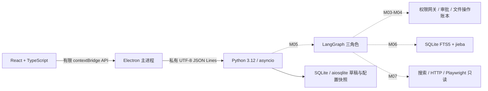

# 序航 Orvia 架构

## 设计依据与当前实现

依据本机技术设计 v0.7（2026-09-28），并以用户本轮要求更新模型映射。旧设计“同任务三个角色共用同一配置”已被下文各角色固定映射替代。
M01 实现桌面通信；M02 已实现 Pydantic/Zod 契约、SQLite 草稿、配置快照、主进程凭据加载与 safeStorage、固定模型适配；M03/M04 提供只读网关、审批动作和账本；M05 已接入 LangGraph 三角色合成闭环；M06 已接入任务范围上下文、偏好和 SQLite FTS5 检索；M07 已接入 Tavily 适配和受限 HTTP/Playwright 读取。其余组件为目标架构，是否完成必须查 DEVELOPMENT_PLAN 和 PROGRESS。

M10 在上述能力上接入对话式桌面界面与 `ChatService`。下文 M01–M08 标记描述历史层次；当前前端入口、持久化与审批行为以本节和模块 README 为准。

## M15 有界模型理解与正文发送

M15 在现有会话增加固定 `chat.synthesis.preview/generate`，不改变文件规划入口。用户选择当前会话 1–3 个 M12 网页或 M13 文档不可变证据版本；后端再次按会话归属读取版本，文档按原页/段/幻灯片单元、网页按正文分块，每源最多选 3 个 600 字片段。摘要采样前/中/后，问答优先 M06 命中并补头部；覆盖率、原提取截断、缺失单元和 OCR 来源明确显示，未选片段不送云端。

renderer 只持证据 ID、模式和问题，不能传正文、路径、模型或供应商。主进程记录实际返回的预览身份，生成前复取并核对 revision，弹原生确认框后才允许一次性发送；取消不调用模型。后端仅使用 Mission 固定 Main `deepseek-flash`/`https://api.deepseek.com`，一次请求、20 秒适配器超时、30 秒等待预算、1024 输出 token、零自动重试；没有工具调用。确认的片段、定位、问题与系统规则进入 Main 云服务，附件选择、网页读取和关键词检索本身均不授予上传权限。Computer/Browser 固定配置不变。

模型结果为 JSON 结论和 `fact/inference/conflict/unknown` 分项。程序只接受本轮片段 ID，复核证据版本、会话和文档单元/网页块定位；冲突至少两个引用，未知项无引用。结构校验不证明语义支持，界面提示回查原文。结果及覆盖、模型名、用量入本地会话消息，原正文仍在证据库；生成请求复用 pending/幂等/中断/取消，不自动重发或触发文件动作、审批与写入。外部资料和模型输出均为纯文本不可信数据，不能改变主进程授权。M20 意图统一与流式协议、M16 成品生成、M19 视觉升级未接入。

## M13 本地文档与导出边界

输入框显式附件选择经 main 原生单文件选择器传入 `chat.document.attach`，renderer没有路径字段。Computer gateway复用PathPolicy拒绝UNC/链接/重解析/ADS/敏感目录并核对读取句柄，不建立父目录权限。10 MiB字节送固定解析子进程，45秒硬预算、独立环境、无云端请求；解析器支持PDF文本、无文本层PDF/图片本地OCR、DOCX段落、PPTX幻灯片，最多50单元/8000码点，44 KiB解析结果。worker不持有用户路径、凭据、网络客户端或授权；无原始附件临时副本。

`document_evidence`复用M12不可变版本存储和归属检查，保留原文件/内容SHA256、时间、提取方式、OCR分数、页/段定位、缺失与截断。M06以`document:<version>:<unit>`索引，询问文档返回最多5个原文引用，不调用生成式模型。文档与网页消息均排除在Main文件规划指令历史之外。历史证据可读不等于原文件权限恢复。

导出预览只生成该版本的Markdown/JSON原文摘录，显示引用覆盖、缺失和截断；main记录预览身份并要求独立保存框确认，消耗一次性预览授权。后端核对revision、PathPolicy校验父路径，`x+b`独占创建、fsync与读回核验；不覆盖、不执行文档指令、不沿用目录审批、不提供任意写内容接口。导出事实回到同会话卡片，失败中断不重放，可能留下需人工核对的部分新文件。此导出不是M04可撤销整理动作。

目录最近20版本/8 KiB、总快照46 KiB；所有请求复用100次会话预算。Office外部关系、宏和加密拒绝；文档中的HTML/URL均纯文本，Markdown原文代码围栏避免活动内容。OCR不等于事实核验，Word段落不是真实页码，不识别复杂布局与公式语义。M13不生成Office/PDF。M14已将这些依赖冻结进未签名测试候选包，独立机器和生产签名由用户暂缓。

## M12 会话来源与证据边界

对话输入框选择文件任务/搜索网页/读取网页/询问已有来源。新增固定 chatBrowserSearch/Read/Ask/Source；main 校验调用来源、严格参数和串行忙碌状态，preload 没有通用 IPC，renderer 仍禁止网络与导航。Browser 请求直接复用 M07 BrowserService，不需目录授权，不产生文件计划。搜索只有 Tavily 专用 POST；正文是 HTTP 优先、受限动态 Playwright，原 URL/DNS/重定向/预算策略不变。

EvidenceStore 在现有 app.sqlite 创建 browser_evidence，按 Mission 隔离，以 URL/模式/正文哈希等确定不可变版本。重复来源去重并保留首次访问时间，新的对话事件记录本次请求时间；搜索摘要与正文独立。M06 索引 source 为 browser:<evidence_id>，引用回查必须同时匹配会话。来源目录最多20项/12 KiB，单独详情最多8000个 Unicode 码点，整体快照46 KiB。TS 使用码点计数，与 Python 一致。网页 HTML、URL、标题都只作为文本，不能驱动权限或工具。

search/read/ask 共享会话请求100次预算和 pending/completed/failed/interrupted 去重；中断不自动重发。来源保存和 FTS 写入不是一个跨模块事务，存储中断保留已落盘来源，显式重复读取可以修复对应索引。source/source_request 消息不进入 Main 文件规划历史。询问来源当前为本地关键词检索，返回最多5个原文片段及引用，不做模型总结/语义问答，不联网；无证据明确说明。固定 Main 仍只处理文件任务，本模块不调用 Browser 模型或更换任何角色配置。

M12 无附件、导出、自动任务、技能市场或浏览器写操作。测试使用真实 Electron/Python/SQLite/Chromium 与合成 DNS/HTTP，不代表真实互联网兼容性或安装包已验收。

## M11 稳定性与进程生命周期

在 M10 受限接口上增加 `chatCancel/connectionStatus/reconnect`。取消仅绑定当前会话和请求，后端只中断模型等待；不取消计划事务、审批或文件动作。stdio 普通请求仍串行且积压上限32，只有 health/chat.cancel 旁路，响应按 ID 配对。错误边界返回固定码，不记录原始异常。

主进程保留活动请求事实；renderer 每秒只查询主进程状态，重载后恢复显示而不重放。后台退出/协议错误/超时使连接不可用，用户明确重连后，主进程等待旧进程关闭，再通过原私有初始化重开同一数据库。旧进程退出无法确认时拒绝启动第二个实例；目录授权随进程失效。窗口关闭优先 EOF 收尾，1.5秒后可终止自有后端；账本仍按 M04/M10 规则识别不确定步骤。保留应用单实例锁，重复启动聚焦原窗口。

请求终态增加 failed/cancelled，会话列表与快照增加事实状态。最近10项操作摘要只含版本、时间、状态与受限撤销可用标记；历史不是可执行审批入口。新规划重试需要用户点击，未知结果只读取账本；数据库忙、磁盘满、权限变化和网络不可用不触发自动业务重试。界面保留阅读位置，折叠长结果，支持输入法及模态焦点。仍无 token 流式输出、自动重连或新增业务能力。

## M10 对话、任务与审批边界

React 侧栏提供新建/历史会话，消息流承载授权提示、只读观察、计划、执行事实；设置保留固定模型和凭据管理。renderer 只能调用固定 `chatList/Create/Get/Send/ChooseDirectory/Inspect/Approve/Resume/Undo`，不能选择私有方法或绝对根。主进程原生选择器取得根后，后端复用 M03 PathPolicy/gateway 校验。测试的模型/选择器替换仅在测试启动器，产品没有自动选目录的环境变量入口。

`chat_conversations` 一对一绑定 Mission；`chat_messages` 按序持久化；`chat_requests` 保存幂等请求和 pending/completed/interrupted 状态，重启未完成请求明确报告中断，不自动重放。原 missions.status 仍是草稿配置快照字段，执行状态以操作账本和会话结果为准，不能据草稿判定完成。

用户发送后，固定 Main 通过 `ModelClient` 提出 answer/inspect/plan。每轮最多3次请求、50秒、单次1024 token，每会话100个发送请求；只使用最近有界消息和当前授权观察元数据，不自动读取正文。Computer 使用程序工具，M10 不调用 Computer 或 Browser 的模型，不改变它们的固定快照。Browser 对话入口在 M12 通过独立来源请求实现，文件规划不自动搜索。

plan 经 ActionService 保存并进入 LangGraph awaiting_approval。审批控件携带会话、operation_id、SHA256 revision；ChatService 核对当前 grant、根路径、归属和最新计划，ActionService 校验摘要、根/源身份和原始路径链，图拒绝重复审批/线程复用。源/目标重复及父目录顺序冲突在计划阶段拒绝。文本“同意”不构成审批。执行成功以逐项账本身份核验为准，不依赖模型叙述。

恢复与撤销必须重新授权原目录；不确定是否落盘的步骤拒绝重放。撤销开始即记录 partially_undone，发生冲突时保留已变更事实。旧 M04 未存身份快照的计划返回 STALE_PLAN，需重建。路径检查不能消除外部进程并发替换的所有竞态，本程序不是 OS 安全沙箱。

快照最多最近30条并按46 KiB裁剪，明确标记 messages_truncated，旧记录保留但暂无分页；只读卡片8 KiB，保留错误和截断证据。会话请求客户端65秒超时，其余开发请求5秒/发布20秒，协议仍为64 KiB。会话历史不恢复目录权限，也不等同执行中任务恢复。自动任务、技能广场、团队管理和推荐信息流不在产品范围。

## 进程与协议（M01）

开发时主进程固定启动仓库 `backend/.venv/Scripts/python.exe`，`shell:false`、`windowsHide:true`；不查 PATH，不拼接 Shell，Python 不直接加载 `.env.local`。发布时由 M08 使用安装资源内固定 PyInstaller 后端；主进程从 `process.resourcesPath/backend/orvia-backend.exe` 启动，不查找系统 Python。
渲染进程启用 `contextIsolation`、`sandbox`，关闭 Node 集成和 webview；preload 暴露 health/settings/missions/createMission/saveCredential/removeCredential 六个固定能力。主进程检查调用者、主 frame、本地页面地址、参数个数及类型；拒绝新窗口、导航、权限请求及网络访问。
stdin/stdout 使用私有 UTF-8 JSON Lines，无监听端口。stdout 仅写协议，stderr 仅诊断。每行最大 64 KiB，包含 CR/LF；Python 超限时分块消费到下一换行并拒绝，避免内存无限增长和帧错位。

请求：`{"v":1,"id":"h1","method":"hello","params":{}}`。
成功：`{"v":1,"id":"h1","ok":true,"result":{"protocol":1,"service":"orvia-backend","python":"3.12.x"}}`。
握手后可调用 `health`，结果为 `{"status":"ok","service":"orvia-backend"}`。
失败信封含 `v`、`id`（无法识别则 null）、`ok:false`、`error.code/message`；固定错误码为 INVALID_REQUEST、UNSUPPORTED_VERSION、METHOD_NOT_FOUND、NOT_READY。
每次进程启动重置握手状态；hello 可重复，health 必须在握手后调用。Python 阻塞读取通过 `asyncio.to_thread` 与调度分离，EOF 干净退出。父进程负责超时及退出清理，不自动重放有副作用请求。

M02 在 hello 后增加主进程私有 initialize，参数为可信数据目录和内存凭据，不能从 renderer 调用；连接内不能替换数据目录。初始化失败终止后端，不自动新建备用数据库。credentials.replace 也仅主进程调用。
业务方法仅 configuration.status、missions.create/list/get，不提供任意后端方法透传。数据库返回经 Pydantic 校验、桌面再经 Zod 校验，生成 Schema 在 `contracts/`，Ajv2020 进行跨语言交叉测试。

## M02 存储与状态边界

`app.sqlite` schema v1 仅创建 missions 表和模型快照不可变触发器，使用外键、WAL、事务及连接内异步锁；未来版本拒绝打开，不覆盖。每个草稿固定三个角色 profile，只有 `draft` 状态。
客户端 client_request_id 为幂等键：相同标题返回原草稿，同标识不同内容报冲突。最新列表上限 20 条，按 ID 仍可读取旧项，暂不分页。SQLite 中没有 Key；UI 不接受自选模型或 SQL。
模型适配使用 httpx、固定 Base URL、无重定向/自动重试、20 秒超时、输出 token 上限与 64 KiB 响应上限。工具调用只作为待校验提议，不执行；模型输出无法变更授权。
M02 验证草稿持久化，不等于 M04/M05 的执行恢复。后续动作/审批/证据和 checkpoint 表按对应模块迁移加入，不提前创建空壳状态流程。

## 三角色与 Mission（M05）

| 角色 | 职责 | 固定模型 | Base URL | Key 变量 |
|---|---|---|---|---|
| Main | 规划、依赖、委派、重规划、证据与完成判断 | deepseek-flash | https://api.deepseek.com | DEEPSEEK_API_KEY |
| Computer | 文件、应用、进程、桌面任务；按需选原生工具或 PowerShell/Git Bash/WSL | glm-5.3-flashx | https://open.bigmodel.cn/api/paas/v4 | ZHIPU_API_KEY |
| Browser | 搜索与页面读取；静态优先 HTTP、动态使用 Playwright | mimo-v2.6-flash | https://api.xiaomimimo.com/v1 | MIMO_API_KEY |

三个角色是同一 Python 后端中的逻辑角色，不是三个服务，也不构成操作系统沙箱。每个 Mission 固化三个角色配置，禁止静默改模型、供应商或 Base URL。
LangGraph 实施经校验的计划与依赖，Main 不直接授予工具权限。程序负责事实核验，不能仅凭模型自述判定完成。MVP 同时仅一个执行子任务；审批、停止、恢复和撤销属于程序接口。M05 使用 SQLite checkpoint 保存图状态，真实模型规划未启用，Browser 服务已在 M07 独立提供但当前图不自动调用。

## 数据、凭据与上下文（M02/M06）

Python 管理 SQLite + aiosqlite 业务库，保存任务、依赖、动作、证据、偏好和审计；LangGraph SQLite checkpoint 保存编排恢复状态。Electron 不直接写业务库。
开发 Key 只放 Git 忽略的 `.env.local`，由 Electron 主进程只读；发布凭据通过 safeStorage 加密并原子保存至 userData/credentials.enc.json，只经私有通道交给后端内存，不进命令行、日志、checkpoint 或安装包。不可用/损坏时拒绝写入，不降级明文。发布 UI 提交后清空密码输入。
凭据落盘与后端同步不是一个事务：同步失败立即停止旧后端并要求重启，避免删除后继续使用旧 Key。桌面限制为单实例；本机 E2E 已验证实际 Windows 加密，完整安装包仍在 M08 验收。
上下文包含滚动摘要、显式偏好、任务内证据检索。轻量 RAG 使用 SQLite FTS5 + jieba 分词，不使用向量数据库，不全盘建索引；M06 只索引调用方明确提交的文本和来源。存聊天不等于完成 RAG。

## 文件安全与审批（M03/M04）

桌面整理限定用户授权的单一本地根目录和普通文件，不跨卷、不穿越符号链接/目录联接，不移动已有目录树，不执行仅大小写变化的重命名。
先只读扫描、文件名搜索、属性、空间分布、大文件和受限 UTF-8 文本；再生成创建目录、移动、重命名计划。用户批准具体版本后重新核对前置条件，执行后逐项核验并记账。
拒绝删除和覆盖。恢复必须区分已执行与未执行，不重放不确定写操作。撤销仅针对最近一次文件变更任务，并检查文件现状和冲突；不能承诺无限历史或无条件回滚。移动文件不算释放磁盘空间。

## Browser 与分发（M07/M08）

HTTP 读取用 httpx + trafilatura，动态页面用 Python Playwright + Chromium。Browser 只读，不复用用户 Cookie，不任意上传本地内容，不提供表单提交和其他浏览器写操作。
M07 私有 browser.read / browser.search 要求现有 Mission；显式 URL 仅允许同源重定向与单页资源，固定公开 IP 连接并保留 TLS 验证。Playwright 所有资源经相同网关 fulfill，CSP sandbox 与资源/时间/字节预算封闭写操作；不复用会话、不自动索引。具体边界和兼容限制见 Browser README。
搜索首个适配 Tavily；未提供 Key 时 `web_search` 明确不可用，不制造结果。已知公开 URL 的读取与搜索配置分别处理。
PyInstaller 已使用 onedir + console 保留 stdio，electron-builder 将后端和匹配 Chromium 放 ASAR 外；M08 已在本机完成资源、FTS5、动态依赖、浏览器版本、安装/卸载验收。无开发环境独立 Windows 机器和签名/发布渠道仍待补验。

## 后续能力边界

M13已经提供受限PDF/OCR/Office文本提取与Markdown/JSON导出，边界见本页M13节。PPT成品、标书、完整行业调研、代码生成、原型、系统清理、任意脚本、桌面点击和浏览器写操作仍未实现。

## M14 本机候选包边界

0.2.0-rc.1 使用现有固定冻结 worker 入口和发布资源路径，收集 PDF 原生库、离线 OCR 模型及 ONNX Runtime。三角色模型与权限边界不变，没有自动更新或额外产品入口。真实安装包在本机以隔离 userData 和系统 PATH 验证，不代表独立 Windows；生产签名与独立机器验收按用户要求暂缓。安装升级保留旧数据；卸载保留用户数据。明确未签名状态、版本/校验和及测试边界见 packaging/README 和 PROGRESS。
