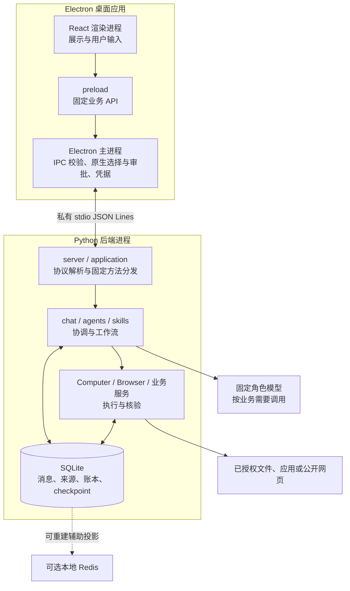
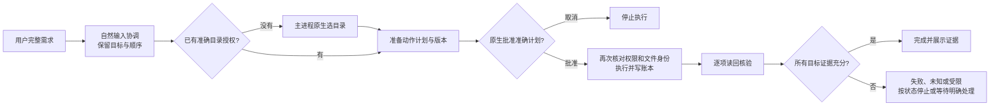

# Orvia 自学指南：从架构到一次可信执行

适合会 TypeScript、略懂 Python、有 Agent 项目经验的读者。目标是用 3–5 天建立概念地图，能解释架构、修改一个模块，并用代码证据回答项目问题。

核对基线：2026-10-08，提交 `892d5b8`，源码包含 V4-011。依据为根 README、AGENTS、ARCHITECTURE、PROGRESS、模块 README 及对应源码。旧文档开头仍有历史状态；能力是否落地，应结合最新实现和 PROGRESS 末尾判断。本文描述开发源码，不能据此推断旧安装包包含全部功能。

## 1. 先用一句话认识产品

**Orvia 是面向 Windows 的本地桌面多 Agent 工作助手，把自然语言需求变成范围明确、必要时经用户审批、执行后有证据可查的任务。**

它从桌面文件整理起步，扩展到资料阅读、带引用回答、简报生成和受限自动化。核心难题是：模型能提出操作，但谁准许它操作、它实际做了什么、什么证据足以说明完成？

可以用五个概念串起全项目：**意图 → 计划 → 权限 → 动作 → 证据**。模型辅助理解和生成，程序掌握授权、状态转换与核验；界面负责让用户看清并控制这些步骤。

## 2. 架构地图：先划进程，再看模块

图中是职责关系，不表示每条请求都经过全部节点。后端还可启动解析、嵌入或自动化工作进程；三角色本身不是三个独立常驻进程。

| 层 | 技术与职责 | 为什么这样分 |
|---|---|---|
| 渲染层 | React + TypeScript，消息、卡片、状态 | 不给页面 Node、任意路径、通用 IPC 或凭据能力 |
| 主进程 | Electron、Zod 校验、原生对话框、safeStorage | 将用户批准与不可信页面输入隔开 |
| 后端 | Python 3.12、Pydantic、asyncio、LangGraph | 严格契约、业务状态机与受限工具执行 |
| 存储与检索 | SQLite + aiosqlite、FTS5 + jieba；可选本地向量 | 事实可回查，检索结果可追溯到原文 |
| 分发 | PyInstaller + electron-builder | 安装包携带私有运行时，不依赖用户 PATH |

JSON Lines 是“一行一个 JSON 帧”的私有管道协议，并非本地 HTTP 服务。请求 ID 关联响应；流式事件还绑定会话、业务请求、流 ID 与递增序号。两端校验结构与大小，stdout 专用于协议。有界队列和背压意味着消费者慢时生产者要等待，不能无限积攒事件。

开发凭据只由主进程读取并通过私有初始化交给后端内存；发布凭据使用 safeStorage，不能明文回退。学习无需查看任何凭据文件。

## 3. 三角色：模型身份与执行权限是两件事

| 角色 | 固定模型与 Base URL | 职责及边界 |
|---|---|---|
| Main | `deepseek-flash`；`https://api.deepseek.com` | 理解、规划、综合与完成判断；提案不能批准自身，最终状态受程序证据约束 |
| Computer | `glm-5.3-flashx`；`https://open.bigmodel.cn/api/paas/v4` | 本地能力角色，也提供代码或脚本草稿；实际执行经程序工具和各自权限链 |
| Browser | `mimo-v2.6-flash`；`https://api.xiaomimimo.com/v1` | 网页能力角色；基础搜索/读取走受限服务，M18 写操作另有站点及请求级审批 |

`backend/src/orvia_backend/domain/__init__.py` 的 `FIXED_PROFILES` 和 `ModelProfile` 固化映射，每个 Mission 保存三个配置快照。禁止失败后静默更换模型、供应商或地址。

**固定配置不等于每步必须调用模型。** 寒暄、明确的目录只读任务、关键词检索等可由程序处理；Browser 的 HTTP/Playwright 读取也不等于向 Browser 模型提问。读 `agents/roles.py` 看逻辑角色，读具体服务调用点看实际行为。

## 4. 跟踪一条完整数据流

以“将合成目录中的 a.txt 重命名为 b.txt”为例：

先在 `chat/coordinator.py` 找自然输入协调，再看 `chat/routing.py` 的路由。文件规划接入 `chat/__init__.py`，`agents/graph.py` 组织准备计划、审批门、执行、核验。它不是包含所有 V4 能力的万能总图；Skills 也有自己的顺序工作流。

主进程 `main/main.ts` 展示原生确认。`computer/actions.py` 的 `ActionService` 将计划版本、审批和操作账本关联起来；`computer/paths.py`、`gateway.py` 检查路径及授权。聊天文字“同意”不能替代这条链。

动作后的证据要绑定当前请求、目标、操作和版本。`chat/task_progress.py` 管理逐目标进度，`chat/verification.py` 从已保存事实检查证据；第一个目标成功不能让后续目标自动完成。

另一条资料主线是：原生选附件 → 本地解析 → 来源/原文检索 → 准确发送预览 → 原生批准固定 Main 请求 → 完整回答及引用校验 → 保存回答 → 独立批准导出成品。流式文字只是临时前缀；未经最终校验，不能用于成品生成。

## 5. 3–5 天阅读路线

每天建议 2–3 小时：约一半读代码，其余画图、定位测试和复述。三天版合并第 1/2 天、第 4/5 天，不要求通读全部模块。

| 天 | 阅读任务 | 当天应交付的学习成果 |
|---|---|---|
| 1 | 本指南 → `docs/ARCHITECTURE.md` → 桌面通信链 | 不看文档画出进程图，说清两个信任边界 |
| 2 | `agents/README.md` → `computer/README.md` → chat 主线 | 跟踪一次重命名，标出审批前后能做什么 |
| 3 | documents → context → synthesis → publication | 解释原文、引用、回答、成品四者关系 |
| 4 | V3 与 V4 的 memory/retrieval/skills/retry | 选两个失败场景，解释为何不能宣称成功 |
| 5 | 一个小改动 + 对应测试 + 自测题 | 提交可审查差异，并完成五分钟项目讲解 |

### 源码入口索引

以下路径相对仓库根；为缩短后续表格，**D = `apps/desktop/src/`，B = `backend/src/orvia_backend/`**。模块目录中的 README 用于查输入输出、预算和已知限制，不必整篇背诵。

1. `D/renderer/main.tsx`：界面入口；`D/shared/api.ts`：页面能调用的业务类型。
2. `D/main/preload.ts`：受限桥接；`D/main/main.ts`、`ipc-policy.ts`：窗口、来源检查和审批入口。
3. `D/main/backend.ts`、`protocol.ts`、`runtime.ts`：后端启动、帧解析与生命周期。
4. `B/server.py`、`protocol.py`、`application.py`：协议接收、输出和固定方法分发。
5. `B/chat/__init__.py`、`coordinator.py`、`routing.py`：会话服务与自然任务协调。
6. `B/agents/graph.py`、`computer/actions.py`：文件任务闭环；然后读 `chat/verification.py`。
7. `B/storage/__init__.py`、`chat/repository.py`：事实如何保存；最后按兴趣进入 V4 服务。

首次不要从庞大的 Application 或 PROGRESS 第一行顺读到底。拿一个需求沿调用链定位，遇到陌生概念再查模块 README。`docs/DEVELOPMENT_PLAN.md` 和 `DEVELOPMENT_PLAN_V2.md` 用于理解历史拆分，PROGRESS 用于核对验证范围。

## 6. 分阶段清单：学什么、看哪里、练什么

练习默认只用自行创建的合成目录和虚构资料；前四天可只读代码，不必调用云模型。

### 阶段 A：通信、权限和编排（M01–M08）

| 模块 | 学什么 / 看哪里 | 练什么 |
|---|---|---|
| M01 | IPC 与帧协议；`D/main/backend.ts`、`B/server.py` | 找出一帧过大或后端断线怎样被拒绝 |
| M02 | 固定配置、草稿与持久化；`B/domain/`、`storage/`、`D/main/credentials/` | 解释保存草稿为何不等于恢复执行 |
| M03 | 只读工具与目录授权；`B/computer/gateway.py`、`paths.py`、`files.py` | 跟踪越界相对路径的拒绝位置 |
| M04 | 计划版本、动作账本与受限撤销；`B/computer/actions.py` | 说明审批后文件变化为何要拒绝执行 |
| M05 | 状态图和 checkpoint；`B/agents/graph.py` | 画出 awaiting_approval 前后的节点 |
| M06 | 分块、FTS5、jieba 与偏好；`B/context/service.py` | 用两个同义但不同词的查询解释召回局限 |
| M07 | 安全 HTTP、动态读取和来源；`B/browser/` | 区分搜索摘要、网页正文与模型总结 |
| M08 | 私有运行时与打包；`packaging/README.md`、`D/main/runtime.ts` | 解释开发解释器与发布后端的区别 |

### 阶段 B：从工具变成可用产品（M09–M20）

| 模块 | 学什么 / 看哪里 | 练什么 |
|---|---|---|
| M09 | 文件整理界面；`D/renderer/main.tsx`、`tests/e2e/m09.spec.ts` | 标出选择目录、计划、批准和结果四个入口 |
| M10 | 对话接入编排；`B/chat/__init__.py`、`D/renderer/ChatCards.tsx` | 区分助手消息和实际操作结果 |
| M11 | 取消、断线和重连；`D/renderer/chat-state.ts`、`D/main/backend.ts` | 解释重连为什么不能重发文件动作 |
| M12 | 会话来源与证据；`B/browser/evidence.py`、`D/renderer/SourceCards.tsx` | 找到来源归属和版本信息 |
| M13 | 文档/OCR、原文导出；`B/documents/` | 比较 PDF 页、DOCX 段、PPTX 页的定位 |
| M14 | 发布验收；`packaging/README.md`、PROGRESS | 列出本机候选通过与正式发行的差距 |
| M15 | 证据回答与上云预览；`B/chat/synthesis.py` | 找到片段选择、发送批准、引用校验三关 |
| M16 | 从已保存回答生成简报；`B/publication/` | 解释生成预览与真正保存文件的差别 |
| M17 | 代码草稿和临时文件隔离；`B/development/`、`cleanup/` | 说明草稿写入不等于运行代码，隔离不等于删除 |
| M18 | 脚本、UIA、浏览器写操作；`B/automation/`、`D/main/m18-ipc.ts` | 对比三种执行方式的授权和核验对象 |
| M19 | 视觉与窗口；`D/main/window-presentation.ts`、`D/renderer/style.css` | 区分原生窗口行为与 CSS 样式 |
| M20 | 自然输入、资料接续、真实流；`B/chat/coordinator.py`、`streaming.py`、`scans.py` | 跟踪取消后已保存的部分结果如何展示 |

### 阶段 C：体验修复与扩展（V3、V4）

| 模块 | 学什么 / 看哪里 | 练什么 |
|---|---|---|
| V3-001/002 | 按需工作区、标题栏；`D/renderer/workspace-state.ts`、`main.tsx` | 解释寒暄为何不应打开无关能力面板 |
| V3-003 | 会话管理和永久删除；`B/chat/management.py` | 找出哪些未决任务会阻止删除 |
| V3-004/005 | 复合目标与信息分层；`B/chat/task_progress.py`、`D/renderer/SynthesisCards.tsx` | 让普通答案易读，同时保留来源详情 |
| V4-001 | 可选 Redis；`B/auxiliary/` | 解释缓存丢失为何不改变执行事实 |
| V4-002 | 声明式 Skills；`B/skills/` | 区分导入、启用、计划批准和叶工具权限 |
| V4-003 | 五轮上下文与记忆；`B/memory/` | 说明自动发现候选为何不等于自动上传 |
| V4-004 | 本地嵌入、FTS 与 RRF 融合；`B/retrieval/` | 区分原文事实和可重建向量索引 |
| V4-005 | 来源支持的实体关系；`B/graph/` | 解释同名实体为何需要消歧 |
| V4-006 | 保留原问题的查询改写；`B/rewrite/` | 比较扩大召回与擅改用户需求 |
| V4-007 | 有限 MCP 客户端；`B/mcp/` | 区分批准连接、工具清单与本次调用 |
| V4-008 | 普通权限 Shell；`B/shell/` | 解释 Job 进程管理为何不等于 LPAC 隔离 |
| V4-009 | 准确进程身份；`B/processes/` | 解释仅凭 PID 为什么可能操作错对象 |
| V4-010 | 有界调研与简报组合；`B/research/` | 分开核对采集、综合和保存三个结果 |
| V4-011 | 安全读取重试与目标闭环；`B/retry/`、`chat/verification.py` | 找出允许重试的工具及失败类型 |

## 7. 必须讲清的边界与易混点

1. **恢复历史不恢复权限。** SQLite 消息和 checkpoint 可持久化，目录授权与一次性批准不能因重启而重新生效。
2. **revision 不是授权。** 它绑定准确内容版本；必须经可信主进程批准并在执行前复核，不能让 renderer 提交 approved 绕过。
3. **证据、摘要、检索命中不是同一层。** 原文及版本提供依据；摘要和向量是派生信息。引用结构合法也不能证明所有语义都正确。
4. **移除附件关联与删除会话不同。** 前者保留历史证据；后者经原生确认永久清理会话正文和证据，但保留用户原文件、已导出成品，也不会回滚既有动作。
5. **accepted 不等于 verified。** 用户明确接受某项限制可结束相应等待，但不能把受限或未执行结果改写为成功事实。
6. **重试有白名单。** V4-011 仅覆盖公开静态读取与本地 SQLite 读取的特定瞬态故障，最多三次 attempt；未知结果、写操作和模型调用不因此获得自动重试资格。M20 非流式降级是用户另批的同模型新请求。
7. **不同执行器隔离强度不同。** M18 Python 使用 LPAC + Job；V4 Shell 和普通进程有普通用户权限，Job 不提供同等文件/网络隔离。MCP 的只读声明也不是系统级安全保证。
8. **能力有界，验证有范围。** 已实现扫描、文档、简报、受限自动化及 V4 扩展；不承诺任意应用接管、全盘智能清理、自动部署、通用撤销或完整行业研究。M17 不执行生成代码；M18 不接管终端、IDE、安全输入或个人浏览器。生产签名、独立 Windows 验收仍暂缓，普通 WSL 执行未在本机真实验收。

## 8. 第一次改模块：做一个可解释的小改动

建议从“完善工作区状态文案，并覆盖一个边界场景”开始。先读 `D/renderer/workspace-state.ts`、`apps/desktop/tests/v3-workspace.test.tsx`，再决定是否需要改 `D/renderer/main.tsx`。目标是展示更清楚，不改变能力启用条件或批准入口。

动手前写三句话：输入是什么、谁拥有状态、什么情况下拒绝。修改后查看差异；涉及类型跑根目录 `npm run check`，运行相关测试可用 `npx vitest run apps/desktop/tests/v3-workspace.test.tsx`。若跨 IPC，再核对 TS/Python 两端契约与对应集成测试。

验证按 L0 静态、L1 模块、L2 接口、L3 用户流程、L4 发布/重大回归选择。只改文档不跑业务测试；日常测试不触发真实模型。新增测试放规定测试目录，报告放被忽略的 artifacts，更新相关说明后审查并本地提交，推送由用户决定。

## 9. 自测题与答案要点

先遮住答案，用自己的话回答，再打开对应代码验证。

| # | 题目 | 简短答案与展开要点 |
|---|---|---|
| 1 | 用一分钟介绍 Orvia，核心难题是什么？ | 自然需求到可信执行。展开意图、审批、动作、证据，举重命名例子，避免只罗列模型。 |
| 2 | 哪两个主要跨进程边界？ | renderer → Electron main；main → Python。定位 preload、main/backend.ts、server.py，说明两边都校验。 |
| 3 | 三角色是否每轮各调用一次模型？配置在哪？ | 否。定位 domain/__init__.py 的 FIXED_PROFILES；说明只读工具、寒暄可零模型。 |
| 4 | 聊天“同意”为什么不执行？ | 文字没有批准能力。定位 main/main.ts 原生框、ActionService.approve 与 revision 复核。 |
| 5 | checkpoint 存在，重启为何还要选目录？ | 状态和权限分离。找 agents/graph.py 与 computer/gateway.py，说明 checkpoint 不是访问许可。 |
| 6 | 源文件审批后变了，在哪里阻止？ | computer/actions.py 的身份/版本检查与 paths.py 路径策略。展开“检查计划”和“执行前再查”两阶段。 |
| 7 | LangGraph 与 agents、graph 目录什么关系？ | agents/graph.py 是任务编排；graph/service.py 是实体关系服务。不能把知识图谱当执行流程图。 |
| 8 | 模型流里出现完整一句话，为何不能导出？ | 它仍可能未校验。定位 chat/streaming.py、synthesis.py、publication/service.py；说明成功保存回答是前提。 |
| 9 | FTS、向量和 Redis 哪个是事实来源？ | 它们不能替代原文/账本。context 管关键词、retrieval 管派生向量、auxiliary 管辅助投影；回到 SQLite 原文与实际动作核验。 |
| 10 | 第一步成功能否让复合任务完成？ | 不能。定位 task_progress.py、verification.py 和 backend/tests/test_v4_task_closure.py；说明逐目标匹配和受限接受。 |
| 11 | 哪些读取失败允许重试？ | 查 retry/policy.py：固定两工具、特定连接前错误/429/503、SQLite BUSY/LOCKED；发送后未知不能重放。 |
| 12 | 为什么 Shell 退出 0、网页 HTTP 200 都不够？ | 只证明局部技术结果。查 shell/service.py、automation/browser.py 与 verification.py；还需目标对应的产物或页面核验。 |
| 13 | 改一个前端操作要追哪些文件？ | shared/api.ts → preload.ts → main 的 IPC/契约 → backend.ts → application.py → 业务服务，再反向核对结果与测试。 |
| 14 | mock 通过能证明什么？还缺什么？ | 能证明替身条件下的分支与契约。真实模型质量、真实网站兼容、原生审批与独立安装环境需各自证据；查 PROGRESS 的覆盖说明。 |

面试讲解可按五分钟组织：一分钟产品与边界，一分钟进程图，两分钟重命名或文档回答链，最后一分钟讲一次失败处理。讲每个设计都补一句“代码在哪里、测试证明到什么程度”，比背技术栈更有说服力。
