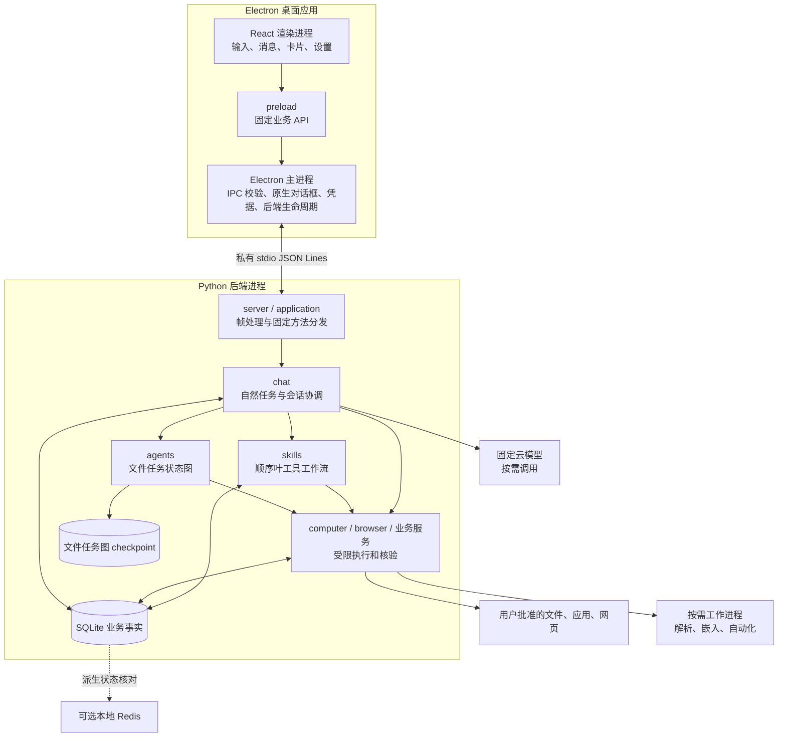
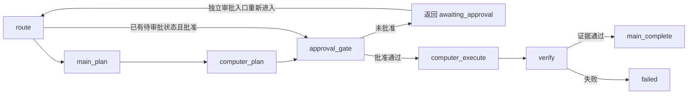
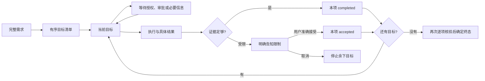
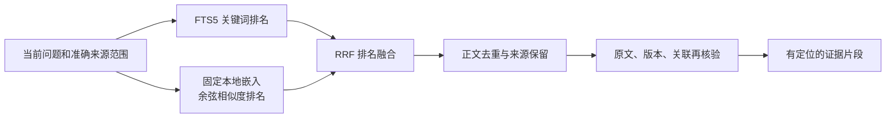

# 理解 Orvia：产品、架构、模块与可信执行

> 本文是一份可以从头连续阅读的项目教程。读完后，你应当能解释 Orvia 为什么这样设计、主要模块内部怎样工作、数据怎样在模块间流动，以及系统凭什么认定任务完成。源码路径用于验证解释，不要求你先读完所有源码。
>
> 适合会 TypeScript、略懂 Python、接触过 Agent 的读者。按 3–5 天安排阅读，但理解设计比赶进度更重要。本文依据 2026-10-08 当前仓库，业务基线截至 V4-011；上一轮文档提交为 `753232b`。它描述开发源码，不代表旧安装包包含全部能力。

## 阅读导航

- 第 1–3 章：建立产品、进程和数据概念，回答“系统由什么组成”。
- 第 4–6 章：理解三角色、文件任务与交互协调，回答“一个需求怎么执行”。
- 第 7–8 章：理解资料、引用、文档及自动化，回答“不同能力怎样保证边界”。
- 第 9–10 章：理解 V4 的记忆、检索、Skills、MCP、Shell、调研与核验。
- 第 11–13 章：用完整案例贯通模块，理解验证与取舍，再用自测检查理解。

文中源码均相对仓库根。为避免长路径打断阅读，**D 表示 `apps/desktop/src/`，B 表示 `backend/src/orvia_backend/`**。例如 `B/chat/coordinator.py` 就是后端自然任务协调代码。

# 第一部分：先建立整个系统的认识

## 1. 产品：为什么聊天助手需要一套执行系统

### 1.1 一句话与三个实际场景

**Orvia 是面向 Windows 的本地桌面多 Agent 工作助手，将自然语言需求转化为范围明确、经过必要审批、执行后能够核验的操作与结果。**

用户不必先理解工具名称，可以提出“看看这个目录有哪些文件”“总结这份资料并生成 Word 简报”“读取这些公开网页并比较观点”。系统随后识别任务、收集缺少的输入、展示必要预览，再调用已有能力。

三个场景看起来都像聊天，实质却不同。目录任务处理用户文件及路径权限；文档任务处理原文、模型发送范围和引用；网页调研处理联网范围、来源质量和覆盖限制。把它们放进同一个输入框，并不意味着可以共用一个无限权限的执行器。

### 1.2 这个项目真正解决的四个问题

第一个是**意图到结构的转换**。一句话可能包含多个目标，比如“扫描目录，按类型整理，然后告诉我结果”。程序需要保留原始需求及目标顺序，不能只抓住第一个动词。

第二个是**建议到授权的转换**。模型说“建议移动文件”只是提案。用户必须知道移动哪些文件、移到哪里、批准的是哪个版本；程序还要证明批准确实来自可信入口。

第三个是**动作到事实的转换**。工具调用返回并不必然说明目标实现：脚本可以退出 0 却没有生成文件，页面可以返回 HTTP 200 却没有完成业务。因此执行结果还要读回、核验、保存。

第四个是**故障后的解释**。应用可能在移动文件后、写数据库前崩溃。重启后必须承认“不确定”，不能因为缺少成功记录就重新移动。可靠性既包括能完成任务，也包括不能完成时不编造成功。

### 1.3 如何理解“本地”与“多 Agent”

“本地”主要指桌面入口、业务数据库、文件工具和很多解析/检索工作在本机进行，不表示所有运算都离线。固定角色模型仍是云端服务；公开网页读取仍需要网络。本地解析与把正文交给云模型是两个阶段，后者需要对应发送审批。

“多 Agent”主要指职责划分。Main 负责规划与综合，Computer 对应本地能力，Browser 对应网页能力。它们不是三个始终互相对话的独立机器人，也不是三个各自拥有操作系统权限的服务。大量步骤由确定性程序完成，既减少模型调用，也让权限和结果更容易核验。

## 2. 进程架构：谁能看见什么，谁能做什么

### 2.1 总体架构图

这是职责图，不表示全部工作流都使用同一个 checkpoint：文件任务图使用专门的 SQLite checkpointer，Skills 另有执行事实账本。各业务服务还可能自己调用模型客户端。主进程与 Python 之间的管道是内部通信；Browser 对网站、模型客户端对供应商的网络请求是另一类边界。

### 2.2 React 渲染进程：界面不是权限拥有者

如果熟悉普通 React 项目，可以把渲染层理解为“读取业务状态并发出意图的页面”。它负责会话列表、文本输入、资料卡片、计划展示、来源详情和各能力面板。

普通网页经常直接请求 HTTP API；Orvia 的页面通过 preload 暴露的固定方法与主进程交互。页面不能获得一个“随便发送 IPC 方法名”的入口，也不能直接拿到 Node 文件系统、任意根路径或后端凭据。

主窗口启用 `contextIsolation` 和 `sandbox`，关闭 `nodeIntegration`。这些设置限制界面代码的能力：外部文档中的恶意文字不能因为被展示，就顺带获得读磁盘、执行命令的接口。它们仍不是整个应用的万能安全证明，后续参数、来源和业务状态校验同样必要。

定位：`D/renderer/main.tsx` 是主要界面入口；`D/shared/api.ts` 描述业务 API；`D/main/preload.ts` 将固定方法接到 IPC。

### 2.3 Electron 主进程：把真实用户动作转为可信输入

主进程有桌面系统能力，因此承担更高的信任责任。目录与文件由它调用原生选择器；敏感操作由它显示原生确认；开发凭据由它读取，发布凭据由 safeStorage 管理；Python 后端也由它启动和回收。

“原生确认”并非换一种弹窗外观。关键在于：确认发生在拥有实际能力的可信进程，内容来自后端准备的准确版本，而不是由页面随意传入 `approved=true`。主进程检查调用页面、主 frame、参数及业务状态，防止一个看起来合法的页面请求变成通用系统调用。

`D/main/main.ts` 保留主要入口，V4 等能力还拆分为 `D/main/skills-ipc.ts`、`D/main/mcp-ipc.ts`、`D/main/shell-ipc.ts` 等专用处理器；`D/main/ipc-policy.ts` 管调用来源约束。不同能力因此可以使用自己的确认内容和权限规则。

### 2.4 Python 后端：业务状态与执行规则的集中位置

Python 负责会话、模型适配、SQLite、LangGraph、文档解析、检索、文件工具及自动化。`B/application.py` 是固定方法分发层；它验证输入并调用服务，而不是允许外部选择任意 Python 函数。

Pydantic 用于运行时契约检查，桌面侧主要使用 Zod。TypeScript 的类型只在编译期存在，不能证明管道收到的数据正确，因此两端都要检查未知字段、值域和输出大小。这看似重复，实际保护的是不同边界。

asyncio 让模型等待、管道读写、状态查询和取消可以协调运行；它不意味着所有有副作用动作都可并发。文件动作、桌面焦点争用、SQLite 事务等仍有各自的串行或锁约束。

### 2.5 stdio JSON Lines：为什么不用一个通用本地 Web 服务

主进程持有 Python 子进程的 stdin/stdout，按行交换 UTF-8 JSON。这样不需要开放监听端口，也不需要让页面知道后端地址；后端随桌面应用建立生命周期。

协议至少需要解决三件事：确定消息边界、把响应交给正确请求、限制异常数据。JSON Lines 用换行分帧，用请求 ID 配对，用版本和 schema 拒绝不兼容输入。每帧有大小上限，不能把整个目录或任意文档一次塞进一行。stdout 专用于协议，混入普通打印就可能破坏通信。

当前还有流式事件：它们除了传输 ID，还携带会话、业务请求、流 ID 和序号。主进程按序校验并向渲染层有界交付。消费者慢时，缓冲达到上限就施加背压，让上游等待；这比无限攒内存后崩溃更可控。

代价是进程退出、半帧、超时、取消和长任务控制都必须自己管理。`D/main/backend.ts`、`D/main/protocol.ts`、`B/protocol.py` 及 `B/server.py` 正是在处理这些问题。

### 2.6 运行时与打包

开发时启动固定的 `backend/.venv/Scripts/python.exe`，不是搜索用户 PATH；发布时启动安装资源中的 PyInstaller 后端。Electron-builder 负责桌面安装包，后端和必要浏览器资源位于 ASAR 外的可信资源位置。

冻结后端不等于可执行任意脚本的 Python 解释器。M18 脚本能力另有私有 CPython 运行时，完整可见浏览器也有自己的资源核验。理解这个区别，就不会把“应用能启动”误当成“所有执行能力都具备运行环境”。

## 3. 数据架构：先区分身份、事实、状态和投影

### 3.1 一段对话里为什么有这么多 ID

| 身份 | 它回答的问题 | 不能拿它代替什么 |
|---|---|---|
| Mission / conversation ID | 属于哪项任务、哪个会话？ | 文件访问权限 |
| request ID | 用户这一次请求是什么？ | 某一次具体文件操作 |
| operation ID | 哪份动作计划或执行记录？ | 用户已经批准 |
| grant ID | 本次有效授权是什么？ | 永久访问许可证 |
| revision | 批准或核验的是哪一版内容？ | 批准本身 |
| thread ID | 哪个 LangGraph 执行线程？ | 聊天中的所有历史任务 |
| stream ID + seq | 哪条增量流、先后顺序是什么？ | 回答已经完整核验 |
| evidence ID / 来源定位 | 哪个原文版本、哪个片段？ | 当前仍有使用权限 |

当前对话与 Mission 一对一绑定，但一个对话可以包含多个用户请求，每个请求又可能有多步操作。假如只用 conversation ID 去标识“成功”，昨天成功的操作就可能被今天的新任务误用；所以证据必须逐层绑定。

revision 通常由准确内容计算摘要。它解决“用户看见 A，执行时却换成 B”的问题，但知道摘要的人并不因此获批。授权入口、内容版本和执行状态必须一起检查。

### 3.2 SQLite 是什么意义上的事实来源

SQLite 保存消息、请求、操作账本、来源版本、生成结果及各模块执行尝试。aiosqlite 提供异步访问，Store 使用事务和锁协调修改。事实来源的含义是：业务判断应回查这些记录，而不能只看屏幕文字、模型自述或缓存通知。

但数据库中的“完成”字段也不能凭空创造物理事实。例如文件动作要记录并核对真实文件身份；成品保存要验证实际字节；浏览器动作要有请求回执及相应页面观察。SQLite 负责保存这些核验结果，核验规则本身仍由程序实现。

`missions.status` 是早期草稿契约中的 `draft` 字段，不是今天所有任务的总状态。会话请求、文件操作、自动化、调研都有自己的状态。阅读源码时把每个 status 都当成“同一种完成标志”，会迅速产生误解。

定位：`B/storage/__init__.py` 保存基础事实，`B/chat/repository.py` 管理会话、消息与请求；各业务服务追加自己的表。程序没有把所有状态塞进一个全局对象。

### 3.3 四类数据不能混在一起

第一类是**原始内容与执行事实**：用户需求、来源原文、操作前后身份、保存回执。这些支撑解释和核验。

第二类是**派生信息**：FTS 索引、向量、摘要、实体关系。它们帮助查找和组织内容，但必须保留原文支持。派生结果失效时不能反过来恢复已撤回来源。

第三类是**临时权限与审批上下文**：目录 grant、准确预览、待接续 token。重启后可以保留“曾经等待审批”的事实，却不能重获当时的访问许可。

第四类是**界面或缓存投影**：最近若干条消息、状态卡片、Redis 通知。投影是便于展示的视图，不是完整账本；列表只显示十条，不代表只需检查这十条才能决定删除会话。

### 3.4 持久化与恢复为什么不是一件事

持久化只是把状态存下来。安全恢复还要回答：操作是否已发生？现场是否变化？原授权是否仍有效？用户现在是否仍希望继续？

因此重启通常把遗留运行标为中断，展示历史，要求重新选择必要目录。文件恢复只在能证明哪些步骤已执行、哪些步骤可以安全继续时成立。模型请求、浏览器写请求或 Shell 未知结果不能简单重发。

这里没有跨 SQLite、文件系统、浏览器服务器的统一事务。先移动文件再写账本可能出现中间故障，先写账本也不能保证后续动作一定发生。项目通过逐步记账、身份核验、保守中断来处理，而不是承诺“恰好执行一次”的万能保证。

### 3.5 删除与迟到结果

永久删除会话不仅删除聊天气泡，还要处理原文、索引、记忆、知识图谱、工作流、checkpoint 和私有任务副本。V3-003 使用删除进度标记协调清理；后续模块在最终写事务检查删除标记，防止正在计算的结果稍后把正文写回来。

例如向量重建在锁外运行本地模型，此时用户删除会话。如果计算结束后直接写库，就会让已删除数据复活。最终事务的来源版本、删除标记及 epoch 检查就是为这种竞争准备的。用户原文件、已导出成品和外部备份不属于这项删除，删除也不是磁盘取证擦除。

# 第二部分：理解任务如何从需求走到结果

## 4. Main、Computer、Browser 与四种不同的编排机制

### 4.1 固定模型表

| 角色 | 固定模型 | 固定 Base URL |
|---|---|---|
| Main | `deepseek-flash` | `https://api.deepseek.com` |
| Computer | `glm-5.3-flashx` | `https://open.bigmodel.cn/api/paas/v4` |
| Browser | `mimo-v2.6-flash` | `https://api.xiaomimimo.com/v1` |

配置在 `B/domain/__init__.py` 的 `FIXED_PROFILES`；每个 Mission 保存固定快照。凭据值不在配置快照中。缺少凭据或供应商失败时，系统不能为了“做完任务”静默换模型。

Main 的职责是理解、规划、综合与判断；Computer 对应本地观察、准备动作和执行已批准动作；Browser 对应网页读取。`B/agents/roles.py` 用能力表表达这些职责，但它只是程序角色限制，并不自动形成操作系统隔离。

### 4.2 逻辑角色不等于必须调用角色模型

列出目录可以直接运行 FileTools；Tavily 搜索走独立搜索适配器；HTTP 读网页不需要让 Browser 模型先思考；生成简报可以把已有回答排版成文件。三角色配置存在，不代表每轮聊天都发生三次模型调用。

Computer 模型确实用于部分代码/脚本草稿生成，但生成出的代码仍是待审数据。Main 可以生成文件动作提案，但不能发放目录权限。模型客户端返回的工具调用建议，也不会自动执行 Python 函数。

`B/configuration/client.py` 负责固定地址、超时、输出预算、完整响应和 SSE 处理。业务模块在它之上决定何时调用、发送哪些内容、如何验证输出。不要把底层模型客户端当成任务协调器。

### 4.3 四套名称相近、目的不同的机制

| 机制 | 所在位置 | 负责什么 |
|---|---|---|
| 自然任务协调 | `B/chat/coordinator.py`、`B/chat/routing.py`、`B/chat/task_progress.py` | 把一句需求连接到已有能力，管理等待、接续和逐目标进度 |
| 文件任务状态图 | `B/agents/graph.py` | 文件计划、审批门、执行、核验、完成，保存图状态 |
| Skills 顺序工作流 | `B/skills/service.py` | 将受限声明编译为有限的顺序叶工具步骤 |
| 来源知识图谱 | `B/graph/service.py` | 保存人物、项目、文件的来源关系，提供有限查询 |

前两者会协作：自然任务发现文件变更需求，调用已有文件任务闭环。Skills 可复用受限工具，但不是自然语言的任意程序。知识图谱中的边是“参与项目”等事实关系，不是下一步要执行的动作。

### 4.4 文件 LangGraph 的真实运行方式

图包含 route、main_plan、computer_plan、approval_gate、computer_execute、verify、main_complete 等节点。名字反映角色，但 main_plan 节点不是每次都再次调用云 Main；它接收上游已准备的动作，检查角色能力并记录计划证据。

这里“暂停”应准确理解：未批准分支返回并保存 awaiting_approval；独立的 `approve_and_resume` 读取 checkpoint 和实际计划状态，再携带批准状态进入图。它不是一个进程永远阻塞着等按钮，也不能把一个新任务直接合并进旧线程的 approved 状态。图还有准备或执行失败分支，上图突出正常审批主线。

## 5. 文件能力：从只读观察到受限变更（M03–M05）

### 5.1 为什么先建立只读层

最初只读工具解决“目录里有什么”：列表、文件名搜索、属性、逻辑空间统计、大文件和受限文本读取。只读结果也必须表达范围；没扫到的文件不能当成不存在，遇到权限错误不能默默忽略后声称完整。

`B/computer/files.py` 负责实际观察，`B/computer/contracts.py` 定义允许参数，`B/computer/gateway.py` 检查 Mission、角色、grant、权限及预算，`B/computer/paths.py` 检查路径。将这些拆开，是为了避免每个工具各自发明一套不一致的安全判断。

普通文本读取也是独立能力：允许的文本类型、字节与编码有上限。授权一个目录供元数据观察，并不天然等于允许把其中全部正文读出或发送给模型。

### 5.2 路径安全为什么不能只检查字符串前缀

假设授权 demo，用户输入 demo/link/private.txt。表面上它仍在授权根内，但 link 可能是指向外部的目录联接。先 resolve 再检查也可能丢失“路径经过了链接”的证据。

PathPolicy 因此关注本地普通根、原始路径链、符号链接/重解析点、UNC、ADS 和实际身份。每次调用还要复核根是否被替换。这样的检查限制可操作范围，但不能消除外部进程在检查与操作之间修改文件的所有竞态；项目并不把普通文件工具称为操作系统沙箱。

### 5.3 重命名如何走完一次闭环

假设在自建目录中将 a.txt 改成 b.txt。首先用户原生选择目录，后端获得当前授权。程序准备计划，核对源存在、目标不冲突、动作类型受支持，并保存源/根身份及 revision。

接着界面展示准确动作，主进程确认“这版计划”。用户确认后，ChatService 核对会话、当前操作、根和 grant；ActionService 再核对版本及现场，只有 planned 可以进入 approved。聊天文字“同意”不参与这条授权链。

执行时，计划先进入 running。每一步变更后保存前后身份，再核验目标与账本是否匹配。全部步骤满足条件才报告完成。如果第二步失败，第一步的实际变化必须保留在账本里，不能用一句“整体失败”掩盖已发生的副作用。

### 5.4 恢复与撤销是不同的问题

恢复问的是“中断的原计划还能不能安全继续”。已记账步骤若现场匹配可以跳过；未记账步骤必须能够证明不会重复副作用。不确定是否已移动时拒绝重放，并要求核对现场。

撤销问的是“能不能执行一组安全的反向动作”。M04 只支持最近一次文件变更任务，且要求目标仍符合执行后身份、原位置不冲突。撤销开始就记录部分撤销状态，因为反向动作也可能做到一半失败。

这一模块拒绝覆盖、删除和跨卷移动等越界行为，也不承诺无限撤销。源码主线在 `B/computer/actions.py`：create_plan、approve、execute、verify、resume、undo_latest 分别对应不同阶段，而非一个万能执行方法。

## 6. 统一交互：界面如何理解并维持一项任务（M09–M11、M19–M20、V3）

### 6.1 M09 与 M10：从独立工具到会话

M09 把目录授权、只读观察、计划审批和结果核验连接到桌面界面。M10 再用会话组织这些过程：用户消息说明需求，观察卡片说明看到了什么，计划卡片说明将要做什么，操作结果说明实际发生了什么。

这些内容都可能出现在消息流里，但业务身份不同。普通助手文字不能代替操作回执；历史计划卡片也不能自动变成有效审批按钮。`B/chat/__init__.py` 是会话应用服务，`B/chat/repository.py` 保存会话、顺序消息及请求身份，`D/renderer/ChatCards.tsx` 等组件呈现不同业务结果。

一次请求先登记请求身份，再逐步处理并保存终态。这样重复送达同一请求时，系统有依据拒绝重复处理或返回已有事实，而不是仅靠页面按钮禁用防止连点。幂等解决重复请求身份，不等于所有外部副作用都可以安全重试。

### 6.2 M11：取消和重连不是“重新来一遍”

早期模型等待可能很长，如果取消请求也排在同一阻塞队列后面，用户按取消不会及时生效。因此服务对健康检查、取消等必要控制建立受限旁路；后续自动化和调研也增加各自必要控制。旁路仍是固定方法，不允许绕开业务审批。

连接失败后，主进程先确认旧后端关闭，再建立新连接，避免两个后端同时操作同一状态。窗口关闭则尽量让后端收尾，必要时回收自有进程。重新连接只恢复服务可用性，不重放原请求。

取消也依业务阶段解释：等待模型时可停止等待；动作已派发时，取消不保证世界恢复原状。若无法获得可靠结果，就必须保留未知或中断。`D/main/backend.ts` 处理连接生命周期，`D/renderer/chat-state.ts` 处理相关界面状态。

### 6.3 M20：自然语言入口如何减少重复输入

M20 将“先选择工具模式”改为统一输入。程序可以直接识别已有明确只读意图，复杂理解再使用固定 Main。用户先说“总结这份文档”而尚未添加资料，系统保存当前需求，等待资料，再接续原请求，而不是要求用户重打一遍。

这里的接续需要绑定当前会话、请求、步骤和一次性 token。旧 token、跨会话 token、已取消请求都不能推进流程。选择目录只满足目录授权，添加附件只满足资料输入；后续文件变更或正文上云仍各有审批，不能把“接续成功”理解成“一切都已批准”。

对象唯一时，系统可以在现有边界内直接处理；有多个可能对象时，只问缺失的信息。`B/chat/routing.py` 负责意图与目标结构，`B/chat/coordinator.py` 负责暂停、接续和驱动，`B/chat/task_progress.py` 记录进度。

### 6.4 真正的流式结果由三层共同完成

第一层是生产真实增量。扫描实际发现条目才产生批次；模型适配器实际收到 SSE 内容才产生文字。`B/chat/json_stream.py` 从结构化响应中增量解出 answer 字符串，不把工具参数或推理字段冒充答案。

第二层是保存与传输。`B/chat/streaming.py` 保存流状态和序号，`B/server.py` 输出有界事件，主进程缓冲后供页面读取。扫描先保存发现条目再发布；模型前缀也先保存，再等待输出。这使崩溃后有依据展示“已经发现或收到的部分”。

第三层是最终核验。模型停止输出后仍须检查结束原因、完整 JSON、引用及业务条件。截断、格式错误或断流只能留下未核验前缀，不能落成成功回答。显示过文字和生成成功是两个时间点。

`B/chat/scans.py` 管理已发现清单。当前自然扫描默认一级，明确递归默认三层、最高八层；数量、十秒总扫描时间和字节预算都有限制，且等待结果发送也计时。分页回查的是保存的扫描快照，不是重新扫描磁盘，所以“完整已发现清单”不代表整个磁盘都已查遍。

### 6.5 M19 与 V3-001/002/005：信息结构也是架构的一部分

M19 统一窗口、字体、图标和视觉。原生窗口控制保留由系统处理，业务区域仍走原权限链。`D/main/window-presentation.ts` 管窗口配置，`D/renderer/style.css` 和 `D/renderer/Visual.tsx` 管视觉资源。

V3-001 进一步区分普通聊天与能力工作区：输入寒暄不应打开所有高级面板，也不需要云模型；实际任务或当前会话历史才投影必要入口。`D/renderer/workspace-state.ts` 负责相应展示判断。历史入口可供查看，并不恢复执行权限。

V3-002 移除顶部重复品牌，保留侧栏、会话标题、状态和原生控制。V3-005 将文档回答分成自然语言答案与来源详情：用户先看到结论、文件名和位置，想核查时再展开技术字段。隐藏技术细节不是删除技术证据。

### 6.6 V3-003：为什么删除对话要检查任务

如果浏览器请求仍可能发出，或隔离文件尚未恢复，直接删除相关会话会丢失核对与恢复依据。因此删除前检查全部相关事实，运行中、待审批、具有未决副作用的记录和未恢复隔离文件可能阻止删除。

审批通过且检查再次满足后，`B/chat/management.py` 清理会话正文、来源、派生数据、相关 checkpoint 和私有副本。跨数据库或文件清理可以中断，所以使用无正文的删除进度标记续做清理。它续做的是删除清理，不是续做原任务。后续纯只读 unknown/interrupted 有自己的可删除规则，不能把所有模块的 unknown 一概当成同等副作用。

### 6.7 V3-004 与 V4-011：完成必须逐目标成立

一句话包含两个目标，第一项完成并不能让整个请求成功。目标清单保留顺序、原文及每项状态；未知或不支持项也必须保留，不能从列表消失。

accepted 表示用户接受当前未完成或受限范围，不能改成 verified 成功。V4-011 在此基础上把目标规范、结果身份及原事实摘要绑定，并在整个请求结束前再次检查。旧消息、重复通知和取消后的迟到结果都不能补造完成。

## 7. 从资料到带引用成品：信息如何保持可追溯（M06、M07、M12–M16）

### 7.1 四种对象：原文件、证据、回答、成品

把“上传了一个 PDF”看作一个动作，会漏掉重要边界。Orvia 实际区分：

| 对象 | 内容 | 它证明什么 |
|---|---|---|
| 用户原文件或公开网页 | 输入材料 | 材料存在，不代表已授权全部使用 |
| 已保存证据 | 提取文字、来源定位、版本、缺失/截断信息 | 程序当时读取到了什么 |
| 已核验结构的回答 | answer、结论类型、允许引用 | 生成结果遵守结构和引用规则 |
| 导出成品 | 新建 Word/PPT/PDF 等实际文件 | 指定版本的内容已按保存流程落盘 |

原文件可能后来变动，但历史证据仍是当时读取的版本。回答应引用证据中的准确片段，成品应来自已保存回答。反过来，文件成功导出也不能证明其中每句话在现实世界都正确。

### 7.2 M06：最初的轻量 RAG 到底做了什么

RAG 是先找相关材料，再让生成过程使用材料。Orvia 的 M06 先建立本地检索基础：调用方显式交给它文本与来源，它分块、用 jieba 进行中文分词，再写入 SQLite FTS5。

分块的作用是控制上下文长度并提供定位。相邻块有一定重叠，减少一句话刚好在边界处被切断。FTS5 则根据词项查找相关片段，适合明确关键词，不保证能识别所有同义表达。

`B/context/service.py` 还保存显式偏好与摘要，但不自行扫描硬盘、不自动读取所有聊天文件，也不等于已经调用生成模型。一个查询只返回原文片段时，应称为检索；将片段交给 Main 后组织答案，才进入生成式证据回答。

### 7.3 M07 与 M12：搜索、读取、保存是三个步骤

搜索通过 Tavily 获取标题、URL、摘要等线索。未配置搜索凭据时明确不可用；这不妨碍读取用户明确指定的公开 URL。搜索摘要不能冒充已经打开页面获得的全文。

读取优先使用 HTTP 和正文提取；必要的动态页面使用 Playwright。动态模式不是失败后的无条件绕过：权限拒绝、超限等不能通过换一个浏览器模式解除。网络出口检查公开地址、DNS、重定向、TLS、资源类型及预算，拒绝本机/内网目标等越界访问。

动态浏览器的资源也经过受限网关，不是浏览器随意直连整个互联网；因此跨源 CDN、登录、复杂交互等可能不兼容。这里的只读服务与 M18 专用写浏览器分开，不能在这个接口里顺手点击或提交表单。

M12 将读取结果接入会话：`B/browser/evidence.py` 保存不可变来源版本，记录 URL、时间、内容哈希、读取模式、截断和错误，再加入任务内检索。相同 URL 内容变化会产生不同证据身份。网页里的“忽略之前规则”始终只是来源文字，不能控制工具权限。

定位：`B/browser/network.py` 管网络边界，`B/browser/service.py` 管搜索/读取，EvidenceStore 与会话服务把结果变成可回查来源。

### 7.4 M13：文档解析是本地内容提取

附件由原生选择器明确选择。当前 M20 最多三份有效资料文件，单份 10 MiB、合计 30 MiB；选择文件不会授权读取整个父目录。解析器接收受限输入，提取 PDF 文本、扫描页/图片 OCR、DOCX 段落和 PPTX 幻灯片。

解析输出不是“文档已经被理解”，而是一组有定位的文字单元。OCR 可能识别错误，Word 段落号不是渲染后的真实页码，复杂表格与公式语义也不是单纯提取文字就能保留。模块因此记录提取方法、缺失、置信信息和截断。

`B/documents/parser.py` 负责格式解析，`B/documents/worker.py` 将解析工作与主服务隔开，`B/documents/service.py` 管证据及导出。M13 可导出 Markdown/JSON 原文引用，不负责总结，也不生成 M16 的 Office/PDF 简报。

### 7.5 M15：怎样把原文交给模型，而不丢掉依据

用户要求“总结这份资料”后，`B/chat/synthesis.py` 从当前会话准确来源版本构造有界证据包。摘要按既有策略抽样片段，问答优先相关检索命中；来源太长时必须展示覆盖和截断，不能声称所有内容都被模型看过。

随后生成准确发送预览，包含拟发送正文、问题、供应商和版本。用户原生批准后才调用固定 Main。文件选择是本地读取许可，不能替代这次外发许可。

模型须返回受限结构：answer 与若干 claims。结论有 fact、inference、conflict、unknown 等类型，引用只能来自本次提供的片段。程序检查 JSON、字段、引用身份及对应规则，再保存 synthesis 回答。

这是一种**结构与来源支持核验**，不是通用事实判真器。一个引用真实存在，不自动证明模型对它的解释正确；引用抽样也不证明全文覆盖。设计尽量让用户能回到原文判断，而不是把回答包装成不可质疑的事实。

### 7.6 M16：成品生成为什么不再需要一个模型

已有 M15 回答包含正文、结论、来源结构，生成固定简报主要是排版问题。`B/publication/service.py` 将它转换成页面计划，再用 python-docx、python-pptx、ReportLab 等生成 DOCX、PPTX、PDF。

这样内容生成与文件制作分开：重排已有回答无需再次上云；每份成品也能追溯到原回答版本。用户可以编辑允许的文字，但引用身份仍来源于后端，修改后的语义是否仍受引用支持需要人工核对。

保存前显示预览，再由原生保存框选择一个新文件位置。后端重新核对版本、独占新建、刷新并读回字节，拒绝覆盖。生成了字节不等于用户已保存；保存成功也不是 M04 文件整理撤销的一部分。

这一条链解释了为什么未核验的流式前缀不能直接制作报告：它还没跨过“完整结构和引用校验”这一关。

## 8. 执行能力：不同工具需要不同权限设计（M17–M18）

### 8.1 M17 代码草稿：生成、写入、运行分别是什么

代码能力先收集显式项目上下文，比如用户选定的少量源文件、当前来源片段或已保存回答。实际发送内容与需求一起绑定 revision，原生批准后交给固定 Computer 模型。

输出仅覆盖已有范围内的 TypeScript/React/Vite 或原生网页文本草稿，有文件数量和大小上限。`B/development/service.py` 保存草稿并提供完整源码/逐文件差异；写入时重新核对目录授权、版本和现有目标身份，再逐文件原生确认并读回。

“已生成”表示得到合规提案，“已应用”表示写入了具体文件；两者都不能证明代码编译、运行或满足原需求。这个模块不自动安装依赖、启动服务或部署。

内置网页原型预览同样不执行模型生成的 HTML/JS。它由固定 React 组件展示受限结构、导航和演示反馈。允许用户看效果，同时避免把任意生成脚本放进应用里执行。

### 8.2 M17 临时文件清理：为什么实际叫隔离

清理只观察当前用户 Temp 顶层、超过三十天的普通 .tmp/.log 文件，拒绝任意清理根、递归全盘识别、系统目录和注册表。程序可以判断扩展名与年龄，不能由此证明文件一定无用。

用户逐项批准后，`B/cleanup/service.py` 再核对身份、年龄与占用，将文件同卷移到隔离区并核验哈希。期限内可通过独立恢复接口回到原位置；冲突或内容变化时拒绝。到期不自动永久删除。

因此“隔离了 100 MiB”不等于“释放了 100 MiB”，同卷移动的实际释放空间为零。这是产品展示必须遵守的物理事实，也是理解受限工具为何不能冒充万能清理器的例子。

### 8.3 M18 Python：让任意源码在有限环境中运行

脚本可来自粘贴、原生单选 .py，或另批的固定 Computer 草稿。无论来源是什么，都必须完整预览；模型生成不是更可信的来源。程序为任务准备私有运行时、显式输入只读副本和隔离输出目录。

LPAC 是 Windows 的受限应用容器权限机制；Job 用于管理进程生命周期及资源。系统先以挂起方式创建进程，检查令牌、隔离和 Job，再恢复执行。零网络/提权 capability、干净环境和句柄限制防止任务继承云凭据或任意能力；隔离不成立就关闭执行能力。

运行有时间、内存、进程、输出等预算。脚本只对隔离副本和产物操作；产物回到用户目录必须逐文件原生批准新建。即使脚本退出码为零，也只是执行结束，不能证明它计算正确或满足完整业务目标。

定位：`B/automation/scripts.py` 管来源、预览和回传，`B/automation/windows_isolation.py` 管私有运行时与 LPAC/Job。它不是完整开发环境，不自动安装第三方依赖，也不承诺所有标准库行为都能通过隔离。

### 8.4 M18 桌面 UIA：操作控件，不是盲点屏幕

UI Automation 通过应用暴露的控件树识别输入框、按钮、选项等。用户原生选择普通权限应用后，系统绑定进程、窗口和实际程序身份，再观察唯一控件。

执行计划包含具体控件、动作、值、前置状态与预期结果。批准后重新观察，确认目标仍唯一、身份未换，再执行单步并读回。它不因找不到控件就回退到盲坐标点击，也不接管终端、IDE、安全输入、个人浏览器等边界外对象。

`B/automation/desktop.py` 和可信 `B/automation/desktop_worker.ps1` 实现这一过程。工作器使用 PowerShell 不等于允许用户注入任意 PowerShell，它只接收固定 JSON 动作。

UIA 读回证明控件状态改变，不保证远端业务结算成功。普通应用也可能自动联网或保存，UIA 没有浏览器那样逐 HTTP 请求拦截的能力。程序因此明确限制场景，而非声称所有桌面操作都可撤销。

### 8.5 M18 浏览器写操作：批准点击还不够

专用可见浏览器使用独立、非持久会话，用户手工登录，登录信息仅在内存，不复用个人浏览器 profile。首先原生确认准确 HTTPS 站点和填表、消息、上传等动作类别；随后每个控件步骤仍要批准。

网页点击后可能触发自动保存、动态 GET 或多个后台请求。因此“允许点击按钮”不等于“允许所有实际外发”。`B/browser/write_network.py` 与 `B/automation/browser.py` 对真实请求形成独立预览和批准，绑定方法、字段、文件和版本。

收到 2xx 响应还不足以 verified；需本步真实回执及批准前指定的新文字出现在真实页面等核验条件。发出后断线、取消或结果未知不能自动重试，否则可能重复消息或交易。这个核验仍不能替代用户对服务器业务真值的判断。

### 8.6 三类执行器不能互相借用许可

M17 允许写草稿，不允许执行；M18 脚本在 LPAC 内运行，不等于授权普通账户 Shell；M18 浏览器的站点授权不等于桌面可以接管个人浏览器；文件目录授权不等于正文上云许可。

这些并列能力共享会话和展示方式，但授权对象、隔离强度、核验依据不同。保持分别设计，才能避免一个看似小的“顺手继续”变成权限扩大。

# 第三部分：理解 V4 如何扩展能力而不改变基本原则

## 9. 上下文、检索与能力组织（V4-001–006）

### 9.1 V4-001 Redis：为什么加了缓存，SQLite 仍不能被替代

Redis 在本项目中承担短期元数据缓存和可重建通知，不保存唯一任务结果、审批许可或正文。默认关闭，用户部署本地服务后可以启用；配置仅允许回环地址等固定范围。

假设某请求状态从 running 变为 completed，SQLite 先保存业务事实及对应派生修订。Redis 通知只携带随机任务标识和修订，消费者收到后仍回查 SQLite，才更新只读状态投影。这样过期通知、重复通知或伪造缓存不能直接让任务完成。

缓存命中也不能免去事实核对。它服务于状态组织和通知，不是一套独立的执行调度系统。连接失效、TTL 到期或队列丢失时，本地 SQL 仍能重建投影，界面应显示真实降级状态。

这个设计牺牲了“纯缓存读”的极致简化，却避免缓存与事实库分裂。`B/auxiliary/service.py` 实现配置、触发器派生状态、发布/消费及生命周期；不存在通过一条 Redis 消息批准文件动作的路径。

### 9.2 V4-002 Skills：可复用的是受限流程，不是任意脚本

项目中的 Skill 是 Orvia 自有 v1 声明式包。目录顶层由 SKILL.md 和 workflow.json 组成：前者供人审查说明，后者描述有限输入、输出、依赖和步骤。它不自动兼容任意第三方 Skill 格式，也不因为名字叫 Skill 就可以执行附带脚本。

导入时程序读取并审查包；注册时重新核对内容；启用只表示允许被选用；计划阶段绑定版本、generation、输入、任务和授权；执行还需批准准确计划。禁用后再启用会改变 generation，旧计划不能因此复活。

步骤可以引用输入或先前步骤输出，但只能使用有限声明，不支持任意表达式和向后引用。依赖图检查循环和深度，编译后成为有限叶步骤。LangGraph 顺序执行这些步骤，可信 dispatcher 注入会话或目录身份，而不是让包自己声明“我拥有哪个 grant”。

例如内置 File Organize 实际执行一级清单与空间统计，它的名字不表示会自动移动文件。Memory Context、Query Rewrite 只走已存在的本地适配；Web Research、Report Build 的准备步骤不能替代联网、上云或保存审批。

`B/skills/service.py` 是核心。若任一步返回 truncated、errors、pending_approval 或 limited，工作流就不能包装成完整成功。理解 Skills 要看三个层次：**声明能表达什么、程序允许哪些叶工具、每个工具仍需要哪些独立许可**。

### 9.3 V4-003 五轮上下文：轮次不是最近五条消息

一轮用户请求可能产生授权提示、工具结果、澄清和多条助手消息。如果简单取最后五条消息，上下文可能只剩某次工具输出，丢失真正的用户需求。

MemoryService 因此以请求身份组织轮次，保留最近五个完整终态请求轮，并单独表达当前未结束状态。工具消息属于原请求，不独立算一轮；缺少完整用户/助手配对的历史也不会被猜成正常完成。

较早内容通过有来源支持的摘要表示。摘要不仅要保留说了什么，还要保留请求是否失败、取消、中断，不能把“曾经建议做”压缩成“已经做完”。预算不足时标明截断，不悄悄抹掉关键状态。

`B/memory/service.py` 的 context 构造的是本地上下文投影，不意味着它会无条件把全部历史交给云端。实际使用记忆或资料仍服从业务发送范围和原生批准。

### 9.4 V4-003 长期记忆：发现、批准、验证、撤回

自动发现候选由本地明确规则完成，例如某些偏好、人物、项目表达。候选不等于可靠记忆，更不等于已经获准发给模型。用户检查准确批次并原生批准后，固定 Main 才整理摘要和候选，程序再验证输出是否有原文支持。

每条记忆带源会话、准确来源、引用与状态。两个来源给出矛盾值时保留冲突，不挑一个看起来更像答案的版本悄悄覆盖。跨会话搜索只返回当前仍有有效支持、符合状态要求的记录。

“纠正”会把用户确切修正保存为新来源，并撤销旧值；“忘记”删除派生记录及相关候选、抑制再次自动发现，但保留原始消息。若要清除源会话正文，应走永久删除会话流程。资料移除后，其支持会被撤回；若某记忆还有其他有效来源，则按规则保留。

这是一套有依据的有限记忆系统，不是模型对用户的无限画像。敏感内容检测也只是有限规则，不能代替用户审查发送预览。

### 9.5 V4-004 混合检索：关键词与向量为什么要一起用

FTS5 对明确词项很直接，但用户换一种说法可能找不到。向量检索把文本映射到固定维度的数值表示，通过相似度找语义接近片段，却可能把“意思相近但不回答问题”的内容排到前面。

Orvia 同时使用两条通道：FTS5/jieba 关键词召回，以及固定本地 Qwen3-Embedding-0.6B 的向量召回。向量是 1024 维，模型工件版本、预处理方式和维度一起进入签名，防止换了模型后误解释旧向量。

RRF 融合不直接相加两种不可比较的原始分数，而根据各通道排名贡献 `1/(60+rank)`。同时在两路靠前的片段通常更有优势。结果去重时仍保留来源位置，不能为了减少重复正文把引用依据删掉。

查询范围在候选阶段就限定 Mission 和准确来源，不能全库检索后再靠前端隐藏其他会话。缺模型、签名错误或无有效向量时回退 keyword_only，并明确原因，不自动下载或更换模型。

重建时先取原文快照，在锁外运行嵌入，再回到事务核对 hash、epoch 和删除标记。清理索引推进 epoch，使旧的后台重建不能在用户清理后重新填回。`B/retrieval/service.py` 管索引与排序，`B/retrieval/runtime.py`、`B/retrieval/worker.py` 管固定本地运行器，`B/retrieval/integration.py` 管当前资料范围接入。

向量是可重建索引，不是第四个云角色，也不负责生成答案。相似度高不证明事实正确；最终答案仍须引用原文。

### 9.6 V4-005 来源知识图谱：关系有方向，也需要证据

向量擅长“找相似片段”，知识图谱则表达“谁与谁是什么关系”。当前实现只处理人物、项目、文件及有限关系，例如负责人、参与、文件属于项目、项目依赖。

假设来源说“合成人甲负责项目合成航线”。模型可以提出实体及关系，但程序要逐字核对原文、实体类型、方向和允许句式。“合成人甲可能负责……”不能删掉“可能”后存为确定关系；项目的两个负责人表述冲突也不能只选一个。

实体身份绑定会话、来源和全文版本。同名人物来自不同来源时不擅自合并，用户须消歧；查询限定有限跳数和范围，不能用缺乏支持的跨来源边组成漂亮但无依据的路径。

`B/graph/service.py` 保存实体、关系、来源支持、调用尝试与撤回事实。模型前后和最后提交都复核来源，移除资料、修改原文或删除会话会使相应支持失效。它不使用大型图数据库，也不承诺任意自然语言关系抽取。

### 9.7 V4-006 Query Rewrite：改写检索表达，不改写用户目标

用户问法与资料词汇不一致时，可用查询改写增加召回。例如资料使用项目正式名称，用户使用经来源支持的简称。风险在于模型“热心扩写”会改变问题，甚至引入资料中不存在的前提。

因此 RewriteService 保留原问题，最多生成三个受限候选；候选必须符合程序基于当前有效资料形成的允许集合。需要 Main 建议时，准确问题、可选记忆和来源片段先预览并批准。未经批准仍可只检索原问题。

搜索始终保留原问题，合并结果后按原文身份去重。来源版本或关联变化时旧候选失效；模型失败或不合规时回到原问题，不能把改写失败变成任务失败后随意扩搜。

`B/rewrite/service.py` 与 Memory Context、Skills、混合检索相连，但边界清楚：记忆提供有支持的背景，改写提供有限查询候选，检索返回片段，后续生成另行处理。跨会话记忆命中也不能授予读取其他会话资料的权限。

## 10. 扩展工具、调研与可靠性（V4-007–011）

### 10.1 V4-007 MCP：标准协议不等于可信工具

MCP 让客户端按标准方式连接服务、发现工具、传入参数并获得结果。Orvia 实现固定版本的有限客户端，支持本地 stdio 服务和准确 HTTPS endpoint 的 Streamable HTTP；它没有因此变成允许任意服务器回调的通用宿主。

授权分四层：审查服务器配置、批准准确程序或 endpoint 连接、审查工具清单及 schema、批准这一次实际调用参数。连接批准不是永久批准所有工具；清单或 session 变化后，旧审查要失效。

服务器声明 read-only 是元数据，不是操作系统强制保证。本地服务器运行在普通用户权限下，Windows Job 管自有进程成员的回收，但不能保证其借助外部 broker 发起的所有行为都被隔离。HTTPS 服务也可能在远端产生副作用。因此工具声明、结果文本不能授予新权限，更不能自行宣告业务成功。

`B/mcp/transport.py` 负责握手、消息、超时与关闭；`B/mcp/protocol.py` 和 `B/mcp/schema.py` 限制协议/输入输出；`B/mcp/service.py` 管审查、版本和调用账本。独立 MCP 凭据由主进程安全存储，不复用三角色凭据。应用重启只加载配置，不自动启动服务或重发旧调用。

### 10.2 V4-008 Shell：比 M18 更强，也就需要承认更宽的风险

Shell 能运行普通用户权限脚本，支持检测本机已有 PowerShell、Windows PowerShell、Git Bash 和满足条件的普通 WSL 发行版。它不自动安装解释器，也不会因为一个不可用就静默换成另一个。

执行前的预览包含解释器身份、完整脚本、工作目录、输入版本、预算和核验条件。批准后还要重新检查可执行文件及输入。`B/shell/runtime.py` 负责实际运行和进程管理，`B/shell/service.py` 负责单次尝试、状态和产物回传。

Windows 先挂起新进程、加入 Job 再运行；WSL 路径用独立进程组等身份控制，并要求能独立回查。这里没有 M18 LPAC 的同等网络和文件隔离，普通 Shell 可以拥有当前用户通常拥有的能力。Job 的强项是管理所属进程，不是限制任意文件路径或保证所有外部进程都被收回。

退出码零只记录 exited。用户要求生成文件时，还要核对指定产物；产物回传另行批准新位置。取消或超时也需确认自有进程是否实际回收，未知结果不自动重试。当前本机没有普通 WSL 发行版，源码中的 WSL 支持不能被描述为已真实通过本机执行验收。

### 10.3 V4-009 进程管理：为什么不能只存 PID

Windows 会复用 PID。上午 PID 1234 属于某个应用，下午同一个数字可能属于另一个。若用户批准后只按 PID 终止，就可能操作错进程。

模块因此绑定创建时间/原始创建身份、实际 exe 路径和内容摘要，并检查当前同用户普通令牌、保护/关键状态等。核验和动作尽量沿同一个 HANDLE 完成，减少查完身份后又按 PID 打开另一个对象的风险。

启动、等待、温和关闭、强制终止分别准备和审批。温和关闭后进程仍运行，要报告 still_running，不能自动升级强杀；等待超时也不等于可以杀掉它。会话删除和服务关闭不会顺手结束已正常释放的用户应用。

`B/processes/native.py` 负责 Windows 原生身份与动作，`B/processes/service.py` 管准确审批包和账本。范围是可核验的普通用户 Windows 进程，不包括按模糊名称批量杀进程、系统关键进程或任意 WSL 内部进程。

### 10.4 V4-010 有界调研：怎样组合已有能力

调研不是新增一个“全知 Agent”，而是组合已有 Browser、证据、检索、M15 综合和 M16 成品。`B/research/service.py` 保存明确问题、URL/搜索范围、来源关联、阶段尝试及结果；`B/research/contracts.py` 限制输入。

创建计划只到 planned，不联网。原生批准采集后，按公开站点和数量/时间预算搜索、读取，保存实际成功、失败、重复、阻止和不可用状态。失败也占尝试预算，不能通过忽略失败无限扩大范围。

研究采集的网页有独立关联，不占用或扩大普通会话“三附件”的有效资料入口。初始选中的会话资料仍必须保持 ready；研究关联不是重新授权已移除资料的手段。

采集后可分批摘要，但最终引用回到原文片段，而不是“摘要的摘要”。批次摘要帮助整理，最终综合展示选择了多少来源、遗漏哪些、哪些正文截断，并要求模型组织比较、冲突、缺口和覆盖。有限十个 URL、两轮搜索等预算意味着它是有界资料调研，不能承诺完整行业研究。

准确采集计划、每次 Main 发送包、每次成品保存分别批准。ready 表示最终带引用回答保存了，不代表 Word/PPT/PDF 已写入；只有实际保存事件核对成功才追加成品回执。Skills 的 research_create 或 report_build_preview 也只准备对应阶段，不跳过这些批准。

### 10.5 V4-011 重试：先判断有没有资格，再考虑重来几次

自动重试可以缓解短暂故障，也可能重复副作用。本模块把资格写在程序中，只允许 `browser.static_read` 和 `context.sqlite_read`，不根据模型说“这个操作安全”或工具自称只读来决定。

静态读取的特定连接前错误、429/503，以及本地 SELECT 的 SQLite BUSY/LOCKED 可以按规则重试。发送后的读写超时或连接中断可能不知道对端发生了什么，保留 unknown；动态页面、Tavily 搜索、模型、Shell、写操作等不因此获得资格。

最多三次 attempt，共享原来的总截止时间和预算，不能每次重试重新获得完整时间。退避还要尊重服务器等待要求；超出剩余时间就停止。网页重定向与重试也共享传输预算，不能相乘后变成无限请求。

`B/retry/policy.py` 写资格与错误分类，`B/retry/service.py` 管调度、取消、期限和账本。账本保留参数摘要、尝试序号、原因、时间与终态，不保存正文或凭据。同业务身份不能因为历史列表被裁剪就重新执行；重启只标中断。

重试服务 succeeded 只说明适配器返回，后续正文、引用或业务核验仍可能失败。与之不同，M20 流式失败后的同模型非流式请求，是一次用户另行原生批准的新调用，不是这里的自动重试。

### 10.6 V4-011 完成核验：把“结果存在”提升为“结果属于这个目标”

最后一层可靠性在 `B/chat/verification.py` 与 TaskProgress。它们核对结果身份、目标规范、原消息、扫描范围、操作账本和完整来源版本，形成目标证据摘要，并在整项请求结束前复查。

假设用户这次要求递归统计，但历史里有一个一级列表成功消息。两者都是目录结果，却不能互相替代：请求、动作类型、路径、深度和完整性都必须匹配。类似地，填入表单不能替代发送消息，报告预览不能替代文件保存，旧生成回答不能冒充本次前置结果。

来源也可能在第一步完成后被移除。最终复查因此不只看“该步骤曾是 completed”，还要确认支持仍有效。取消或失败后的迟到响应通过条件更新被拒绝，不允许把终态复活。

该层仅读已有 SQLite 事实，不为了检查而重新读取用户文件或恢复权限。它能证明的是程序所定义、所观察到的目标条件，不是任意现实业务的最终真相。不能验证的目标必须说明限制、等待明确接受或取消。

# 第四部分：把模块连接起来理解

## 11. 三个完整案例：从用户视角回到内部机制

### 11.1 案例一：“把 a.txt 改名为 b.txt，然后说明结果”

**输入阶段。** React 接收完整原文，通过固定 API 交给主进程，再进入 Python 自然任务协调。路由保留变更与后续说明的顺序。若尚无目录授权，当前请求暂停，等待主进程原生选目录；页面不能自己补一个绝对根路径。

**计划阶段。** 已有授权仅说明可以在此范围准备任务。后端检查源与目标、生成受限文件计划、保存身份和 revision，并让文件状态图停在审批门。模型即使参与理解，也不能将自己的计划标为已批准。

**执行阶段。** 原生确认批准准确计划，ChatService 和 ActionService 再检查归属、当前授权、版本及现场。真实重命名后写入逐项账本，读回目标身份；若发生冲突就停下，并说明已经完成了哪些动作。

**闭环阶段。** 当前变更目标绑定这次操作的证据，后续说明只能依据该事实。最终逐目标核验通过后结束。若磁盘动作后、记账前崩溃，重启只恢复中断事实；不能因为用户原文仍在就重新执行。

这个例子贯通 M01/M02 的通信与事实、M03/M04 的权限与动作、M05 的图、M10/M20 的会话协调以及 V3/V4 的目标完成判定。它也是为什么系统需要多种 ID、原生批准和独立账本的最小案例。

### 11.2 案例二：“总结这份 PDF，然后生成 Word 简报”

**等待输入。** 请求先保存，在没有唯一资料时等待附件或必要澄清。原生选择 PDF 只允许读取这份文件；父目录不会因此授权。

**本地理解材料结构。** 文档工作器提取文字/OCR，保存页或其他定位、原文版本、缺失与截断。此时系统有“提取证据”，还没有“总结答案”。页面可以展示解析结果，但不能声称模型已经读懂全文。

**准备模型输入。** Synthesis 根据任务构造准确片段包，必要时用 FTS/混合检索挑选相关原文，预览实际发送内容。用户批准固定 Main 请求后，界面开始显示真实增量；断流时只能保留未核验部分。

**保存回答。** 完整生成结束，JSON 与引用通过校验，synthesis 才作为成功回答保存。复合任务把这个结果绑定为下一步前置条件，不从无关旧消息中随便挑一份替代。

**制作成品。** Publication 读取已保存回答，生成固定简报计划；用户原生选择新文件保存，网关独占创建并读回，保存事件回到当前请求。到这里才能说“Word 简报已保存”。

如果用户在总结后取消保存，真实结果是“总结已完成，成品未保存”，不是整个任务全失败，也不是整个任务全成功。事实的分层让这种部分完成可以准确表达。

### 11.3 案例三：“比较三个指定公开网页的观点，制作带引用 PDF”

**建立范围。** 通过调研入口保存问题及明确 URL/站点。创建计划不访问网络；批准采集后 Browser 按固定网络策略读取。某个网页失败时如实记录，不用搜索摘要或模型常识伪装成该页正文。

**保存证据。** 每个成功来源保存原文版本并绑定研究任务。检索只在准确研究范围内工作；当前会话其他附件或旧网页不会悄悄混进来。超过预算、网页截断及采集失败进入 coverage。

**综合观点。** 必要的批摘要和最终综合分别预览并批准。最终比较引用原文片段，冲突需要相应不同来源支持。若只有两页可用，就说明第三页缺失，不能写成“已全面比较三页”。

**生成与保存。** 最终回答 ready 后才允许准备 PDF；保存仍走独立原生选择、字节生成与读回，Research 只在收到准确保存事实后记录成品。

如果流程由 Skill 准备，Skill 返回“待采集批准”或“待保存”属于有意义的中间结果，不意味着 Skill 可以绕过用户完成剩余步骤。流程组合复用业务边界，而不是消除它们。

### 11.4 用一张表区分六种“成功”

| 看到的结果 | 可以说什么 | 还不能说什么 |
|---|---|---|
| 模型生成完毕 | 收到了完整响应 | 引用正确、任务已执行 |
| 引用结构核验通过 | 回答遵守当前来源规则 | 所有自然语言结论客观为真 |
| Shell exited 0 | 进程正常退出 | 产物正确、业务目标完成 |
| Browser 收到 2xx | 请求获得响应 | 远端业务已经结算 |
| 调研 ready | 最终回答已保存 | 全行业覆盖、报告已经导出 |
| 文件保存读回通过 | 指定新文件已按流程写入 | 内容语义无误、可通用撤销 |

理解 Orvia 的关键不是记住多少功能，而是知道每个状态到底证明到哪一层。

## 12. 工程设计、模块关系与已知取舍

### 12.1 M01/M02 是所有后续能力的共同底座

M01 建立窗口、受限 IPC、Python 子进程和健康响应，先证明跨语言链路可以可靠通信。它本身没有完整 Agent 业务，也不需要真实模型。

M02 增加严格契约、Mission 草稿、SQLite、固定模型及凭据管理。其意义是先确定“身份和配置由谁定义、数据存在哪里、秘密由谁接触”。后续模块在这个底座增加业务表和服务，不把控制权交给模型文本。

根 `contracts/README.md` 解释跨语言契约；当前能力还在桌面和 Python 的各业务 contracts 文件中实现严格校验，不能只看早期生成的 schema 就认为覆盖全部版本。模块 README 是接口与边界说明，PROGRESS 是实际验证记录，二者作用不同。

### 12.2 M08/M14：能打包、能安装、能正式发行是三个层次

打包先保证资源收集正确：后端依赖、SQLite FTS5、解析库、浏览器和字体等必须进入合适位置。安装还要验证真实路径、启动、升级、卸载与数据保留。正式发行进一步涉及生产签名和独立机器环境。

项目已有本机未签名候选和相应安装对照，但生产签名、独立 Windows 验收仍暂缓；后续 V3/V4 开发提交没有自动重建安装包。使用旧候选不能检验最新源码能力。

`packaging/README.md` 和 `D/main/runtime.ts` 说明资源及启动。M14 完整发布验收不能因为本机 PATH 隔离测试通过就算完成：开发机仍可能拥有别的机器没有的运行资源。

### 12.3 测试设计为什么分级，又为什么区分 mock 与真实

L0 检查静态、类型、语法、配置和文档；L1 看单模块；L2 看跨模块契约、数据库与权限集成；L3 看用户流程和 Electron–Python 实际链路；L4 用于重大跨模块回归或发布验收。级别描述覆盖范围，不是一张“级别越高就自动证明一切”的等级证书。

例如模型 mock 可以稳定制造错误 JSON、假引用、断流和超时，用来验证防线。真实临时 SQLite 可以验证事务、重启与删除竞争。真实 Electron 配合模拟原生选择器，则能验证很多界面/通信流程，但不能据此宣称人工原生对话框、真实供应商语义或任意公网网站已通过。

测试分布在 `backend/tests/`、`apps/desktop/tests/`、`tests/integration/`、`tests/e2e/`；产物在忽略的 artifacts 目录。理解验证时应问“什么是替身，什么是真实组件，输入是否合成，没覆盖什么”，而不是只记一个通过数量。

### 12.4 这些设计的收益与代价

**固定模型与严格结构**提高配置可追溯性，避免隐性更换供应商；代价是供应商不可用时不能自动找别家完成。程序必须把不可用清楚地展示出来。

**原生逐次审批与准确版本**降低错误扩权和内容替换风险；代价是高风险流程需要更多用户参与。统一自然语言只简化入口，不删掉必要确认。

**SQLite 事实与可重建派生数据**便于本地回查、删除和故障解释；代价是需要认真设计事务、并发、版本与迁移。Redis、向量等不能绕过事实层。

**有限输入、输出和时间预算**让资源可控、结果可审查；代价是大目录、长文、复杂网页经常只能得到部分结果。承认截断比扩大范围后假装完整更符合产品设计。

**保守恢复与未知结果不重试**减少重复副作用；代价是某些故障需要用户核对，自动化率不会达到“永远自己修好”。对于真实文件和外部服务，这是一种有意识的取舍。

### 12.5 模块在整张地图中的位置

这张索引用来回顾正文，不是另起一套待阅读大纲。

| 模块 | 在整体系统中的位置 | 本文对应内容 |
|---|---|---|
| M01 | 窗口、IPC、stdio 通信 | 第 2 章、12.1 |
| M02 | 契约、固定配置、凭据、SQLite | 第 3–4 章、12.1 |
| M03 / M04 / M05 | 只读授权、文件动作账本、状态图 | 第 4–5 章 |
| M06 / M07 | 本地文本检索、网页基础读取 | 7.2–7.3 |
| M08 | 私有运行时与初始打包 | 2.6、12.2 |
| M09 / M10 / M11 | 工具界面、会话闭环、稳定性 | 6.1–6.2 |
| M12 / M13 | 网页来源、文档原文证据 | 7.3–7.4 |
| M14 | 安装、升级与正式发布准备 | 12.2 |
| M15 / M16 | 带引用回答、固定简报成品 | 7.5–7.6 |
| M17 / M18 | 草稿与隔离清理、三类受控执行 | 第 8 章 |
| M19 / M20 | 视觉、自然入口与真实结果流 | 6.3–6.5 |
| V3-001 / 002 / 005 | 工作区、品牌层级、回答分层 | 6.5 |
| V3-003 / 004 | 永久删除、复合目标 | 6.6–6.7 |
| V4-001 / 002 | Redis 辅助、Skills | 9.1–9.2 |
| V4-003 / 004 / 005 / 006 | 记忆、混合检索、知识图谱、改写 | 9.3–9.7 |
| V4-007 / 008 / 009 | MCP、Shell、进程管理 | 10.1–10.3 |
| V4-010 / 011 | 有界调研、安全重试与目标核验 | 10.4–10.6 |

已实现的是上述明确范围内的能力，不是通用自主操作系统。全盘垃圾识别、任意应用接管、自动部署、无条件撤销、完整行业研究与任意文档模板等不能由这些模块名称推导出来。

## 13. 理解检查：十五道题与展开答案

### 1. 为什么 Orvia 既需要 Electron 主进程，又需要 Python？

**简答：两者承担不同信任和技术职责。** 主进程拥有窗口、原生选择/确认、安全凭据和子进程生命周期；Python 集中业务状态、数据、模型及工具。React 发意图，主进程把真实用户授权变成可信参数，后端执行并核验。删掉中间校验只让页面直连工具，会把原本分开的显示与权限混在一起。定位第 2 章的 preload、backend、server、application 链。

### 2. 固定三角色是否代表所有请求都调用三个模型？

**简答：不代表。** 固定配置确定“若调用这个角色，用哪个模型”，逻辑能力决定“这个角色能做什么”。目录读取、原文检索、文件核验等可以零模型。Main 提案与 Computer 程序执行并不要求两次云调用；Browser 读取也不等于 Browser 模型回答。定位 `B/domain/__init__.py` 与实际业务服务调用点。

### 3. 一次文件批准到底批准了什么？

**简答：准确任务下的一份具体版本计划。** 除动作列表，还要绑定 operation、revision、根与源身份、当前授权。批准的是 a.txt 到 b.txt，不能后来换成另一个文件。聊天“同意”、知道 revision、renderer 自带 approved 都不是同等批准。定位 `D/main/main.ts` 与 `B/computer/actions.py`。

### 4. 保存了 checkpoint，为什么不能重启后自动继续？

**简答：checkpoint 只描述图状态，不描述当前用户许可和真实现场。** 目录可能被替换，操作可能已发生而账本未收尾，用户也可能不再希望继续。必须重新取得必要授权并检查事实；不能证明未执行的副作用不得重放。定位 `B/agents/graph.py`、ActionService.resume 及恢复记录。

### 5. 文件动作为什么不能只靠一次数据库事务保证？

**简答：数据库事务不能同时回滚外部文件系统。** 重命名发生与 SQLite 写入之间存在故障窗口。程序因此保存前后身份、逐项核验并对未知结果保守处理。若中途失败，已完成的动作不能被错误描述为“什么都没发生”；撤销本身也会失败。

### 6. 搜索摘要、来源证据、检索结果、生成回答有何区别？

**简答：分别是线索、保存的输入依据、选中的原文片段、模型组织的输出。** 搜索摘要不是全文；检索命中不等于理解；引用有效不等于语义真理。每一层应保留来源和限制。定位 `B/browser/evidence.py`、`B/context/service.py`、`B/chat/synthesis.py`。

### 7. 为什么 UI 已显示模型文字，仍不能生成 Word？

**简答：流式前缀还没通过完整响应和引用核验。** 供应商可能随后截断，JSON 可能无法闭合，引用可能不合法。只有成功保存的 synthesis 才能进入 publication；失败前缀是可展示的历史，不是有效成品输入。定位 `B/chat/json_stream.py`、`B/chat/streaming.py` 与 `B/publication/service.py`。

### 8. Redis、FTS、向量和知识图谱是什么关系？

**简答：它们服务不同目的，均不能代替原始依据。** Redis 帮助状态通知；FTS 找关键词；向量找相似片段；知识图谱组织明确实体关系。后三者应指向准确来源，Redis 状态应回查 SQLite。删除或撤回来源后不能利用派生信息恢复旧许可。

### 9. 长期记忆“自动”体现在哪里，审批又在哪里？

**简答：本地发现候选可以自动，云端整理需逐批准确批准。** 程序还核对原文、冲突和来源版本。跨会话搜索不意味着可自动把别的会话资料发给模型。纠正、忘记和删除源会话是不同操作，影响范围不同。定位 `B/memory/service.py`。

### 10. agents/graph、graph/service 与 Skills 是一套东西吗？

**简答：不是。** 文件状态图编排动作，知识图谱保存关系，Skills 组合受限叶工具。自然任务 coordinator 再把用户目标与这些业务入口连接。回答时应说清“图里的节点是什么”：执行阶段、工具步骤或实体，不能只因都叫 graph 就混为一谈。

### 11. MCP 工具标了 read-only，为什么仍要逐次批准？

**简答：那是服务器的声明，不是 OS 隔离保证。** 还要审查程序/endpoint、工具清单、schema 和实际参数；版本/session 变化使旧审查失效。本地服务拥有普通权限，Job 只能管理所属进程，返回文字也不能证明业务已完成。定位 `B/mcp/service.py` 和 transport。

### 12. M18 Python 与 V4 Shell 的安全边界有何不同？

**简答：前者依靠 LPAC + Job 及私有输入输出环境，后者是普通账户 Shell。** Shell 的脚本、cwd、解释器和预算虽经批准，但没有同等网络/文件隔离。两者产物回传都需要对应确认，且退出 0 都不证明业务正确。定位 `B/automation/windows_isolation.py`、`B/shell/runtime.py`。

### 13. 只读失败为什么也不能全部自动重试？

**简答：工具标签或 GET 方法不足以证明一次请求没有副作用或结果已知。** V4-011 只允许程序列明的两类工具和错误；连接前故障与发送后未知不同，总次数与时间也不能重置。定位 `B/retry/policy.py`，说明为何模型调用与动态网页不在白名单。

### 14. 一个目标完成后，整个任务为什么还要再次核验？

**简答：目标可能多项，证据可能过期或被撤回。** 必须确认结果属于本次请求与准确步骤，范围和操作相符，且来源仍有效。accepted 只能表示用户接受限制。定位 `B/chat/task_progress.py`、`B/chat/verification.py`，再看 `backend/tests/test_v4_task_closure.py` 的反例。

### 15. “本机 E2E 全过”可以怎样讲，不能怎样讲？

**简答：说明实际覆盖的组件和条件，不扩大结论。** 若模型、原生选择器或网络是替身，就只能证明替身条件下的链路；不能据此保证供应商质量、公网站点兼容、独立 Windows、生产签名或旧包的新功能。核对 `docs/PROGRESS.md` 的最新证据与未覆盖项，避免引用旧标题判断当前状态。

## 建议的五天阅读节奏与核对来源

第一天读第 1–3 章，尝试不用术语复述“界面、主进程、后端、事实库”的关系。第二天读第 4–6 章，用一条重命名需求解释计划、审批、执行、核验。第三天读第 7–8 章，明确资料的生命周期和三种自动化权限。第四天读第 9–10 章，把 V4 放回原有架构。第五天读案例、自测，回查仍讲不清的源码位置。三天阅读可合并前两天、后两天，不必把理解变成赶进度。

若只做一次源码核对，按 `D/renderer/main.tsx` → `D/main/preload.ts` → `D/main/main.ts` → `D/main/backend.ts` → `B/server.py` → `B/application.py` → `B/chat/coordinator.py` 跟踪入口，再选择一个业务服务。此时源码验证的是你已理解的链路，不再是一堆陌生目录。

本教程主要依据 `README.md`、`AGENTS.md`、`docs/ARCHITECTURE.md`、`docs/PROGRESS.md`、`docs/DEVELOPMENT_PLAN.md`、`docs/DEVELOPMENT_PLAN_V2.md`、`docs/V3_OPTIMIZATION.md`、`docs/V4_OPTIMIZATION.md`，以及各业务目录 README 与上述关键实现。文档中历史“未实施”“无重试”等描述需要结合后续修订阅读；当前能力以对应实现和最新验证为准。

真正理解这个项目的标志，是能够对任一结果连续回答：**输入从哪里来、经过哪些模块、哪一步取得权限、保存了什么事实、什么情况下拒绝、最终到底证明了什么。**
